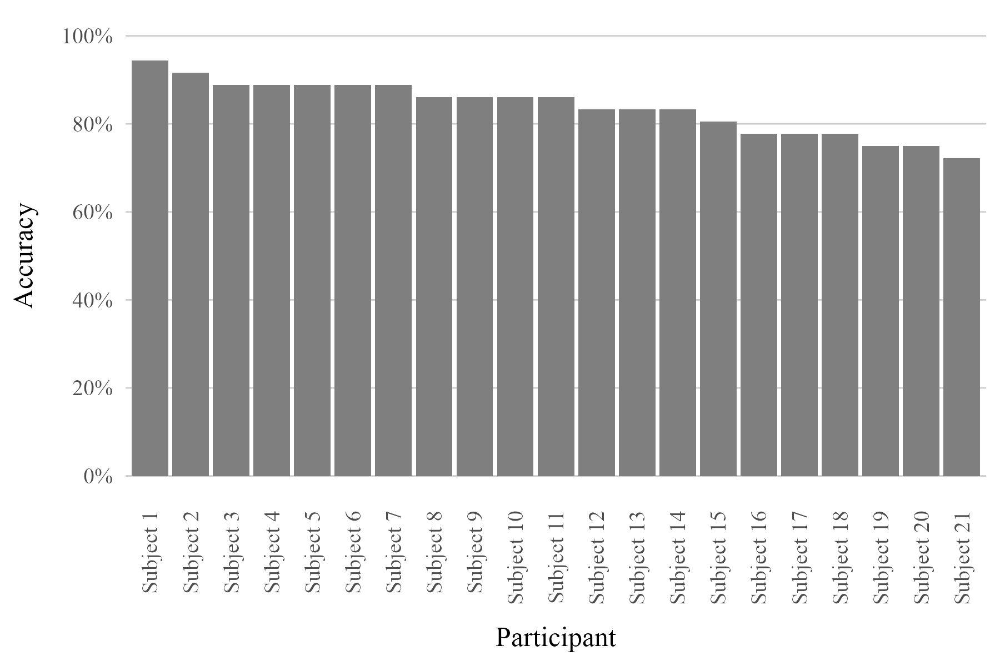

```{=latex}
\begin{titlepage}
  \centering
  \vspace*{4cm}

  {\fontsize{24}{28}\selectfont \textbf{EFFECTS OF NUMBER DISSIMILARITY ON JAPANESE EFL LEARNERS' PROCESSING OF SUBJECT AND OBJECT RELATIVE CLAUSES}\par}
  \vspace{1.5cm}

  {\fontsize{16}{20}\selectfont
  A master’s thesis presented to the Faculty of \\
  English/Linguistics Studies of the University of Stuttgart \\
  for the degree of Master of Arts in English and \\
  American Studies/English Linguistics
  \par}
  \vspace{2cm}

  {\fontsize{16}{20}\selectfont Presented by: \\
  Takumi Kobayashi \par}
  \vspace{1cm}

  {\fontsize{16}{20}\selectfont Supervised by: \\
  Dr. Titus von der Malsburg \par}
  \vfill

  {\fontsize{14}{18}\selectfont Stuttgart, June 11, 2025 \par}
\end{titlepage}

```


\clearpage
\thispagestyle{empty}  
\pagenumbering{roman}  
\setcounter{page}{1}   


```{r setup, include=FALSE}
knitr::opts_chunk$set(echo = TRUE)
```


\clearpage
\thispagestyle{plain}  
\pagenumbering{roman}  
\setcounter{page}{2}   
\section*{Acknowledgments}
\vspace*{1.5cm}

First of all, I am profoundly grateful to my parents and brother. I was born and raised in a small town surrounded by mountains, like a fortress, in Japan. Although it is a beautiful place, it is unbelievably conservative at the same time. My parents, however, showered me with unconditional love and gave me the courage to step out into the world. From my mother, I received imagination about the "outside world"; from my father, courage and drive; and from my younger brother, peace of mind.


I also sincerely thank my partner Sarah and her family. Their continuous encouragement and devoted support during times when I was overwhelmed by anxiety meant the world to me. Above all, I am thankful for meeting Sarah and her family and always being by my side.


Most importantly, I wish to express my deepest gratitude to Dr. Titus von der Malsburg, my thesis supervisor. Although his methodological and theoretical advice always gives me variable insights, his positivity, smile and belief in my ability gently push me forward and give me confidence that I could succeed. I would also like to thank Dr. Anna Pryslopska and Mr. Nico Wildermuth for their valuable advice on the experimental methods used in my master’s thesis.


Special appreciation is also extended to the members of the department, including the previous program coordinator of MA-EASEL, Dr. Thomas Waegenbaur for his patient support and guidance, and the ifLA secretary, Mr. Ralf Bothner for his flexible support.


\clearpage
\thispagestyle{plain}  
\section*{Abstract}
\vspace*{1.5cm}
\noindent
This thesis investigates asymmetry in processing difficulty in Japanese EFL learners between English subject and object relative clauses. Besides exploring the existence of the asymmetry between the two different types of relative clauses, the facilitation effect of number dissimilarity on processing the relative clauses is also examined. In other words, the first purpose of this thesis is to clarify whether Japanese EFL learners exhibit the asymmetry (subject relative clauses are easier to process than object relative clauses) which is reported by a majority of the existing studies. The second goal is to examine whether the EFL (English as a foreign language) learners utilize number marking as a clue to process the relative clauses more smoothly or accurately. To elucidate the presence of the asymmetry and the facilitation effect of number dissimilarity, an online self-paced reading task is conducted and reading time and comprehension accuracy for the questions are analyzed. The findings of this thesis showed the asymmetry of the processing difficulty, meaning Japanese EFL learners read subject relative clauses faster than object relative clauses. Another key finding is the Japanese EFL learners utilized the number dissimilarity between the head and local NPs to process the sentences with relative clauses. Since Japanese usually does not use overt marking in number, the facilitation effect of the number mismatch in Japanese EFL learners supports the learners of English as a foreign language can sharpen the sensitivity toward numbers and make use of it as a hint to process relative clauses. To the best knowledge of the author, this thesis is the first study that focuses on the facilitation effect of number dissimilarity in the Japanese EFL learners. In addition to that, the studies focusing on the facilitation effects of morphological marking to relative clause processing are still scarce. Therefore, this study contributes to our understanding of the facilitation effects of morphological marking on sentences with relative clauses. However, it is indispensable to accumulate the studies with different methodologies, participants and language settings to build a deeper understanding.

\clearpage
\pagenumbering{roman}
\setcounter{page}{4}  

\pagestyle{plain}
\tableofcontents

\clearpage
\pagestyle{plain}
\listoffigures

\clearpage
\pagestyle{plain}
\listoftables

\clearpage
\pagenumbering{arabic}
\setcounter{page}{8}

\thispagestyle{empty}
\vspace*{-1cm}
\begin{flushleft}
\Huge \textbf{Chapter 1}
\end{flushleft}
\vspace{0.3cm}
\noindent\rule{\linewidth}{0.6pt}


\pagestyle{fancy}
\fancyhf{}  
\fancyhead[L]{\nouppercase{\leftmark}}
\fancyfoot[C]{\thepage}

# Introduction
Figuring out how complex sentences are processed is meaningful for psycholinguists to understand the mental processes underlying language processing and comprehension [@GordonEtAl2001]. In the field of psycholinguistics, sentences with relative clauses (RCs) have been frequently highlighted as a research subject over the decades due to their nested and relatively complex structure. As it is explained more deeply in the following section, a large body of existing studies have supported the finding that subject relative clauses (SRCs) are easier to process than object relative clauses (ORCs) [@GordonEtAl2001; @TraxlerEtAl2002]. This phenomenon, the subject-object asymmetry has been studied by many scholars across different language settings and methodologies. The subject-object asymmetry is positioned as the main topic in the present study because there is still room for further study, especially in the L2/EFL context.

There are striking differences in the morphosyntactic features of relative clauses across languages. For example, in German relative clauses, case marking is essential, whereas this feature is not observed in English relative clauses. German speakers have been reported to rely on these case distinctions as cues to facilitate processing of relative clauses. Even children as young as 5–6 years old use case marking to comprehend relative clauses correctly [@Edeleva2023]. In addition, German and English have head-initial structure. However, some languages such as Japanese or Korean have head-final structure. These cross-linguistic differences in structures and morphological systems play some roles in relative clause processing. The present study focuses on the influence of cross-linguistic factors, particularly the influence of Japanese as a first language on English RC processing.

Another perspective that this study examines is the influence of number dis/agreement or number mis/matching on the RC processing. In some languages such as English and German, nouns are morphologically marked and distinguished based on whether they are singular or plural. However, other languages such as Japanese do not mark nouns morphologically for number, except in some specific cases. It is important to note that the concepts of singularity and plurality exist when recognizing objects. Japanese language does not consistently mark singular/plural distinctions through inflection or morphological elements. Thus, it is meaningful to examine whether this morphological marking or additional elements would back up parsers to process sentences with RCs. In other words, learners of second or foreign languages encounter number marking as a new concept through learning the target language. For instance, Japanese EFL learners usually encounter the number agreement and morphological marking in English for the first time through the school English class and native English speakers who start learning Japanese experience the system not required number agreement. Needless to say, there are many combinations of those language settings. In this study, the influence of differences in number agreement between Japanese and English is regarded as a possible factor which affects the Japanese EFL learners' processing of relative clauses.

Studies investigating the processing of relative clauses began with a focus on English as a first language, subsequently expanding to explore the influences across a variety of other languages and cross-linguistic contexts. Even though many previous studies have explored cross-linguistic influence between different combinations of target languages, the studies considering the effects of number mis/matching on RC processing in EFL (English as a foreign language) are still scarce. Therefore, the present study examines both relative clause processing and influences of number mis/match between the head and local nouns in the sentences with RCs as the two main topics

## Overview
This thesis is structured as follows. In Chapter 2, the foundation of relative clauses (RCs), including RC types, structures and cross-linguistic differences are covered. Afterwards, the two central topics of this thesis are recapped. First, the subject-object asymmetry, which is a main topic of this thesis, is introduced along with various accounts for this phenomenon. In fact, there are numerous accounts and theories aiming to explain the mechanism of the subject-object asymmetry from different viewpoints. This thesis attempts to overview those different accounts by dividing the accounts into four types: syntactic and typological accounts, memory-based accounts, experience-based account, and semantic account. After presenting the overview of the subject-object asymmetry and the possible accounts, another main theme of this thesis, which is the influence of number morphology on relative clause processing, is brought into focus. A theory called Relativized Minimality (RM) underlying the hypothesis that the number morphology helps parsers process relative clauses more easily and smoothly is reviewed. Subsequently, some existing empirical studies that reported the facilitation effects of the number dissimilarity on processing RCs are introduced.

Chapter 3 outlines the research questions and corresponding hypotheses of this thesis. There are two research questions. First, it is verified whether Japanese EFL learners show the subject-object asymmetry when reading English sentences with relative clauses. The second question is whether the number dissimilarity between the head and local NPs facilitates their processing of relative clauses. Since there are several existing studies that have confirmed the asymmetry in Japanese EFL learners, it is hypothesized that the participants in this study would show the asymmetry as reported in those reference studies. In regards to the second research question, there are no reference studies with Japanese EFL learners to the best knowledge of the author. Therefore, the hypothesis is based on contrasting results between existing studies recruited participants with different first languages. Based on the fact that there is no overt marking of numbers in Japanese and the results from a study with Chinese EFL learners did not show a facilitation effect, the hypothesis established there would be no facilitation effect of the number mismatch on RC processing by Japanese EFL learners.  

Chapter 4 explains the methodology in order to probe the two research questions. Besides the questionnaire about participants' general and language-related background, the online self-paced reading task is conducted. This section provides detailed information on the online self-paced reading task with the information of participants, task, stimuli, design and procedure.

In Chapter 5, the results of the online self-paced reading task and statistical analysis towards the results are presented. At the beginning of this section, it is explained how the collected data is pre-processed and controlled in quality. After that the results of statistical analyses are reported separately in comprehension accuracy and reading time. In brief, the reading time shows some differences among conditions and proves the existence of the subject-object asymmetry in Japanese EFL learners. Contrary to the initial hypothesis regarding the second research question, the facilitation effect of the number dissimilarity is confirmed based on the reading time data. This particular result provides new data from the previously untested participant group and language setting.

In Chapter 6 and 7, it is discussed how this study interprets the results from the self-paced reading task and pre-existing studies and how the study can be improved in certain aspects. This study confirmed both the subject-object asymmetry and the facilitation effect of the number mismatch in relative clause processing by the Japanese EFL learners. Those results support most existing studies reporting the asymmetry and also provides new findings on the facilitation effects of number mismatch in Japanese EFL learners. Indeed, these results are novel in that they suggest that English learners, especially those whose first language, Japanese does not mark number in general, utilize number information as a cue when processing English relative clauses. However, due to the absence of a control group of native English speakers and the relatively small sample size, it is still premature to generalize the findings of this study. In addition, there is still some room for improvement in the experimental stimuli, particularly in terms of semantic control. Overall, this thesis presents both strengths and areas for further improvement.


```{=latex}
\newpage
```

```{=latex}
\clearpage
\thispagestyle{empty}  % ← 章扉ページはヘッダー・フッターなし
\vspace*{-1cm}
\begin{flushleft}
\Huge \textbf{Chapter 2}
\end{flushleft}
\vspace{0.3cm}
\noindent\rule{\linewidth}{0.6pt}
\pagestyle{fancy}  % ← 通常ページに戻る
```
#  Background
## Relative Clauses
\indent　Relative clauses (RCs) are the clauses that modify nouns. Relative clauses are frequently employed in many languages due to their functionality.In English, there are some types of relative clauses based on the grammatical and semantic roles of the head nouns. These different types of relative clauses are overviewed in the following sub-section, "Subject-Object Asymmetry and Various Accounts". One of the focal points in this thesis is the difference between subject relative clauses (SRCs) and object relative clauses (ORCs). Referring to the example sentences (1a-b), the relative clauses are bracketed. In the sentence (1a), the head noun, *the reporter* is interpreted as the subject of the verb, *attacked* in the relative clause, via a dependency formed by the relative pronoun, *that*. In other words, the main clause subject, *the reporter* also plays as the subject in the relative clause. Conversely, the head, *the reporter* is interpreted as the object of the verb, *attacked* in the relative clause in the example sentence (1b). In the sentence (1b), the main clause subject, *the reporter* plays two different grammatical roles in the main and relative clauses.

```{=latex}
\vspace{1em}
{
\setlength{\parindent}{0pt}
\noindent
\begin{tabular}[t]{@{}ll}
(1a) The reporter \textbf{[that attacked the senator]} disliked the editor. [SRC] \\
(1b) The reporter \textbf{[that the senator attacked]} disliked the editor. [ORC] \\
\end{tabular}
\vspace{1em}

\noindent
\begin{quote}
\small
\textit{Note.} These examples are from Warren \& Gibson (2005, p.752).
\end{quote}
\vspace{1em}
}
```

It is beneficial to investigate the comprehension and production of these two different relative clauses not only to see processing and productive difficulty between SRCs and ORCs, but also to explore the mechanism of language processing including the different memory load and processing strategies. It contributes to building and reflecting the morphosyntactic and semantic theories, and to visualize the cross-linguistic difference and construct implicational universals over languages.

In addition to the different types of RCs based on the grammatical and semantic roles of the head noun of the relative clauses, there are also cross-linguistic differences in terms of structures and use of relative clauses. First, different languages adopt the different orders of constituents of relative clauses. Some languages employ head-initial structure and others contain head-final structure of relative clauses. In other words, the head-initial structure has the word order like the head noun is deployed first then the relative clause follows after the head noun. On the other hand, the relative clause comes first and then the head noun follows in the head-final structure. Interestingly, there are tendencies which languages have which structural types as explained as follows by Kortmann (2020).

\vspace{1em}

> One hallmark of typology is its constant effort to establish correlations between properties of different languages. For example, in most languages where the verb precedes the object (so-called VO-languages like English or French), prepositions and relative clauses follow their nominal heads. Conversely, most OV-languages (like Turkish and Japanese) have postpositions and relative clauses which precede their nominal heads. Such generalizations are preferably formulated as so-called implicational universals, e.g., "A language which has SOV as its canonical word order is very likely to have postpositions."  
>  
> — Kortmann (2020, p.117)

\vspace{1em}
Yet it is not merely a cross-linguistic difference, positions of subordinate clauses are also considered influential to the processing difficulty. The place of the subordinate clauses are categorized left-embedded, center-embedded, and right-embedded as in the example sentences (2a-c) below. In English, the center-embedded relative clauses have been reported as the hardest of all to process because of their structure like a hamburger. Parsers read a part of the main clause first, then delve into the relative clause, and they finally come back to the main clause again after reading the whole relative clause. On the other hand, sentences with right and left-embedded clauses can be halved between the main and subordinate clauses. Actually, there are some studies compared processing difficulties among these different embedding positions. Zhai et al. (2019) conducted the eye-tracking experiment with manipulated sentences with center-embedded, left-embedded, and right-embedded reduced relative clauses. As a result, the Chinese EFL learners showed center-embedded relative clauses to the hardest, followed by right-embedded, and the left-embedded as the easiest. By confirming the eye movement measures, it was reported that the participants had more frequent fixations and also longer fixation duration especially at the part of center-embedded relative clauses, and also the parsers showed more complicated scanning pattern which implies the center-embedded relative clauses induced confusion in Chinese EFL learners during their processing of relative clauses in English. Furthermore, the difficulty of the center-embedded relative clauses has been reported in other studies as well [@HashimotoHirai2007].  

```{=latex}
\vspace{1em}

\setlength{\parindent}{0pt}
\noindent
\begin{tabular}[t]{@{}p{0.05\linewidth} p{0.75\linewidth} >{\raggedleft\arraybackslash}p{2.5cm}@{}}
(2a) & The cheese \textbf{[the rat [the cat chased] ate]} was rotten. & {\small [center-embedded]} \\
(2b) & The cat chased the rat \textbf{[that ate the cheese [that was rotten]]}. & {\small [right-embedded]} \\
(2c) & \textbf{[[[John]'s brother]'s wife]'s friend} came to see me. & {\small [left-embedded]} \\
\end{tabular}

\vspace{0.5em}

\noindent
\begin{quote}
\small
\textit{Note.} These examples are from Kuno (1974, p.119).
\end{quote}

\vspace{1em}
```

\setlength{\parindent}{1.27cm} 
In addition to the word order, relative clauses in some languages explicitly use relative pronouns like, "that" or "which" in English. However, languages like Japanese and Korean use no relative pronouns. If the languages have agreements including number, case and gender, the relative pronouns also visibly mark those features like in German. In English, relative pronouns are omitted from relative clauses under certain conditions and informal spoken situation. As for a further difference, restrictive relative clauses (also known as defining relative clauses) and non-restrictive relative clauses (also called as non-defining relative clauses) are separated with comma for non-restrictive relative clauses in English. The restrictive relative clauses explain the essential information about the head and the non-restrictive relative clauses explain supplemental information about the head noun. Languages like Japanese does not explicitly mark the distinction between restrictive and non-restrictive relative clauses and these two different RC types are inferred from context and prosody. In German, both restrictive and non-restrictive relative clauses tend to be marked with comma, which also differs from English and Japanese. When listing those differences in word order and explicit marking of relative clauses among different languages, the list could be endless. Nevertheless, such cross-linguistic variations are frequently studied in the context of multilingualism and second or foreign language studies. These studies help reveal how speakers' first languages influence the processing and production of relative clauses in their second or foreign languages. Some of the existing empirical studies focused on those cross-linguistic differences are introduced in the following sub-section.


\indent　As introduced above, relative clauses vary widely across languages in their structure, marking, and usage. Also, relative clauses are categorized based on the grammatical and semantic roles of the head noun into subject relative clauses, object relative clauses and so on. Among the various types of RCs, subject relative clauses (SRCs) and object relative clauses (ORCs) have received particular attention in the psycholinguistic field. This is primarily due to the robust asymmetries observed in their processing and acquisition patterns across many languages. The asymmetry between SRCs and ORCs is one of the fundamental topics in this thesis. The next section describes the phenomenon of SRC–ORC asymmetry and reviews key theoretical accounts for the asymmetry.

## Subject-Object Asymmetry and Various Accounts
\indent　A large body of previous studies has reported that subject relative clauses (SRCs) are easier than object relative clauses (ORCs) to process in various languages based on empirical data from eye-tracking or online self-paced reading experiments (e.g., Staub, 2010; Mak et al., 2006; Cohen & Mehler, 1996; Schriefers et al., 1995; Kwon et al., 2010; Ishizuka et al., 2003). As explored in the previous section, there exist different types of relative clauses within and across languages. Despite that, most studies have confirmed the existence of the subject-object asymmetry. On the other hand, there are actually studies reporting the opposite asymmetry that ORCs are easier than SRCs, for instance in Chinese [@GibsonWu2013], Hebrew [@Arnon2010] and Basque [@CarreirasEtAl2010]. Currently more studies have supported the existence of the asymmetry between SRCs and ORCs although there are some cases reporting the contrary results. It is also an undeniable fact that those supporting studies have been conducted majorly in European languages such as English, German, and Dutch. In other words, the studies examining the asymmetry in non-European languages and also studies in the second language or foreign language contexts still remain limited. While many researchers generally agree that subject relative clauses (SRCs) are easier to process than object relative clauses (ORCs) across languages, the situation with less studies with non-European languages suggest that the widely accepted view might shift in the future, depending on the accumulation of more empirical data from understudied languages.

The widely observed processing advantage of subject relative clauses (SRCs) over object relative clauses (ORCs) has attracted significant attention in the field of psycholinguistics. Numerous experimental studies, especially those using eye-tracking, self-paced reading, and ERP methodologies, have consistently shown that SRCs are read more quickly and comprehended more easily than their ORC counterparts. This asymmetry has prompted researchers to propose various theoretical accounts that endeavor to explain the cognitive and structural underpinnings of this phenomenon. Referring to the example (3a-b), the word order from the subject of the main clause to the end of the relative clause in sentence (3a) with omitting the relative pronoun, *that* follows SVO order. This order is canonical in English. On the other hand, the sentence (3b) starting from the subject of the main clause then after the subject of the relative clause appears immediately which is confusing to parsers as of the order like SSV order (Warren & Gibson, 2005). Others argue that SRCs place a lower burden on working memory because the parsers are demanded to hold the information of the head NP longer till attaching it to the main clause verb in ORC sentences (King & Just, 1991).

Apart from the syntactic structure and memory load based on the linear distance, some studies focus on the frequency of the RC types and words used in the sentences with relative clauses. Simply put, their view is that more frequent and familiar structures and lexical combinations should be read faster and more accurately because parsers get used to them and rather expect those canonical patterns are coming. Semantic and discourse factors have also been studied recently and it has been reported that semantic factors also play a role in shaping how different types of relative clauses are processed. Here the semantic relatedness between the NP1 (head) and NP2 (local), thematic roles, animacy, plausibility between the subject and verb and so on. In order to explore these possibilities in greater depth, the following sections introduce four major accounts that have been proposed in the literature: syntactic or typological accounts, memory-based accounts, experience-based accounts, and semantic accounts. All in all, these hypotheses offer complementary insights into the mechanisms that may contribute to the SRC advantage and help explain both cross-linguistic consistency and variation.

```{=latex}
\vspace*{1em}

\setlength{\parindent}{0pt}
\noindent
\begin{tabular}[t]{@{}p{0.05\linewidth} p{0.75\linewidth} >{\raggedleft\arraybackslash}p{0.15\linewidth}@{}}
(3a) & The reporter \textbf{[that attacked the senator]} disliked the editor. & [SRC] \\
(3b) & The reporter \textbf{[that the senator attacked]} disliked the editor. & [ORC] \\
\end{tabular}

\vspace*{0.5em}

\noindent
\begin{quote}
\small
\textit{Note.} These examples are from Warren \& Gibson (2005, p.752).
\end{quote}

\vspace*{1em}
```

\clearpage

\setlength{\parindent}{1.27cm} 
### Syntactic Accounts
The first group of the accounts is based on syntactic structure and typological studies. In the following sub-sections, four different typological and syntactic hypotheses which initially classified different RC types and comparatively considered the processing difficulty of those different RC types are introduced.The four major hypotheses introduced here are grounded under differing theoretical assumptions. Most of them are supportive toward the existence of the subject-object asymmetry.


#### Noun Phrase Accessibility Hypothesis (NPAH)
One of the most influential syntactic accounts proposed to explain the relative ease or difficulty in processing different types of relative clauses is Noun Phrase Accessibility Hierarchy Hypothesis (NPAH) introduced by Comrie and Keenan (1979). Although the original aim was to clarify the typological constraints on relativization across languages and not specifically to solve the processing asymmetry between SRCs and ORCs, this hypothesis is based on implicational universals. In short, Comrie and Keenan (1979) compared over 50 languages and suggested the order in which grammatical roles are more or less frequently and naturally relativized. Specifically, NPAH ranked grammatical roles such as subject, direct object, indirect object, oblique, genitive, and object of comparison—according to their accessibility to relativization. As shown in Table 1, the order is as follows: subject (SU) > direct object (DO) > indirect object (IO) > oblique object (OBL, or object of preposition in English: OPREP) > genitive (GEN) > object of comparison (OCOMP). This order shows the universal hierarchy among those different types. In other words, NPAH claimed that if a language has GEN type of RCs, the language must have the rest in the higher hierarchy (SU, DO, IO, and OPREP). It is also impossible to reverse and skip the order in NPAH. For instance, it is unexpected that a language has GEN type but no SU type. As introduced above, the main purpose of NPAH was not to point out the mechanism of the subject-object asymmetry, rather it offered significant insights from both educational and psycholinguistic perspectives. Today, the NPAH is regarded as supporting the view point that SRCs are more difficult than ORCs to process.

\vspace{1em}
```{R Table1_NPAH, echo=FALSE}
library(knitr)
library(kableExtra)

table_data <- data.frame(
  RC_type = c("SU (Subject)", "DO (Direct Object)", "IO (Indirect Object)",
              "OPREP (Object of Preposition)", "GEN (Genitive)", "OCOMP (Object of Comparative)"),
  Example = c("the girl that came...",
              "the girl that John hit...",
              "the girl that he spoke to...",
              "the girl that he sat near...",
              "the girl whose father died...",
              "the girl that he is taller than...")
)

kable(table_data, "latex", booktabs = TRUE,
      col.names = c("RC type", "Example"),
      caption = "Example sentences for different RC types in the NPAH (Gao, 2014)",
      escape = FALSE) %>%
  kable_styling(full_width = FALSE, position = "center")
```
\vspace{1em}

#### Parallel Function Hypothesis (PFH)
While the Noun Phrase Accessibility Hierarchy (NPAH) classified RC types based on their grammatical functions, other studies have employed classifications with other perspectives such as the linear order of constituents and the syntactic position where the relative clause is embedded within the sentence. According to Savin and Perchonock (1965, as reported in Bever, 1970), the case which the first-encountering verb in the sentence was the verb of the relative clause was harder to comprehend than the pattern that the first-encountering verb was the verb of the main clause. Combining with the example sentences (4a-b), sentence (4a) is inferred harder than sentence (4b). Following the hypothesis by Savin and Perchonock (1965), Bever (1970) considered that listeners who participated in the listening task conducted by Savin and Perchonock (1965, as reported in Bever, 1970) responded to the first Noun-Verb (N-V) sequence which appeared in the sentence. In short, the participants contained the bias as if the first N-V structure constituted the main sentence structure (main clause). Yet this tendency with expectation is based on canonical order and experience, this would make confusion in specific cases such as the relative clauses. Since the first verb in the sentence is expected to be the main clause verb, the relative clauses, specifically center-embedded relative clauses would cause confusion in listeners and parsers and they will be required for reanalysis.

```{=latex}
\vspace{1em}

\setlength{\parindent}{0pt}
\noindent
\begin{tabular}[t]{@{}p{0.06\linewidth} p{0.67\linewidth} >{\raggedleft\arraybackslash}p{0.22\linewidth}@{}}
(4a) & The boy \textbf{[who likes the girl]} hit the man. & {\small [first verb = RC verb]} \\
(4b) & The boy hit the man \textbf{[who likes the girl]}. & {\small [first verb = MC verb]} \\
\end{tabular}

\vspace{0.5em}

\noindent
\begin{quote}
\small
\textit{Note.} These examples are originally from Savin and Perchonock (1965) as cited in Bever (1970, p.295).
\end{quote}

\vspace{1em}
```

Related to the N-V sequence and order of constituents proposed by Bever (1970), Sheldon (1974) illustrated the influence of the order and relation between subject and object in both main and relative clauses. Four different types of sentences (see Table 2) were designed and used in the experimental task to examine three possible influential factors on RC processing; the position of the embedded RC, word order in RC, grammatical roles of the identical nouns. In the experiment, children of native speakers of English participated in a toy-based comprehension task. They used toy animals to demonstrate the meaning of sentences with relative clauses. As a result, Sheldon (1974) reported that children performed better under the condition where the co-referential NPs had the same grammatical function such as both NP1 and NP2 had subject roles and both NP1 and NP2 had object roles than the condition where the two NPs had different grammatical roles such as NP1: subject and NP2: object and NP1: object and NP2: subject. Based on Table 2, SS and OO which have parallel functions eased children's comprehension. From the perspective of the subject-object asymmetry, SS and OS are categorized as SRCs and SO and OO are equivalent to ORCs. Therefore, the order of processing difficulty proposed in Sheldon (1974) was not perfectly in accordance with the subject-object relative asymmetry.

\clearpage

\vspace{1em}
```{r Table2_Sheldon, echo=FALSE, results='asis'}
library(knitr)
library(kableExtra)

table_data <- data.frame(
  "Head_NP" = c("subject", "subject", "object", "object"),
  "Local_NP" = c("subject", "object", "subject", "object"),
  "Label" = c("SS (parallel)", "SO (nonparallel)", "OS (nonparallel)", "OO (parallel)"),
  "Example" = c(
    "The dog that jumps over the pig bumps into the lion.",
    "The lion that the horse bumps into jumps over the giraffe.",
    "The pig bumps into the horse that jumps over the giraffe.",
    "The dog stands on the horse that the giraffe jumps over."
  )
)

kable(table_data, format = "latex", caption = "Four RC Types Tested in Sheldon (1974)", booktabs = TRUE, longtable = TRUE, escape = TRUE) %>%
  kable_styling(full_width = FALSE, font_size = 11)
```
\vspace{1em}

#### Perceptual Difficulty Hypothesis (PDH)
In 1970-1980s, the typological observations including the NPAH were actively conducted by scholars. There are eventually some other hypotheses proposing different hierarchical order of relative clause types. As reviewed in above, the NPAH and the PFH also suggested different hierarchies of processing difficulty. Considering from the subject-object asymmetry, these orders are contrary. In addition to these hypotheses, there is another hypothesis, Perceptual Difficulty Hypothesis (PDH) which was proposed by Kuno (1974). Kuno (1974) considered the effect of the short-term memory limitations on RC processing and suggested a different order from the NPAH. The perspective of PDH was more into processing difficulty, perceptual and memory load. In the PDH, relative clauses were categorized into four types (SS, SO, OS, and OO) the same as Sheldon (1974) based on the grammatical role of the NPs in main and relative clauses (see Table 2). The PDH described that the embedded positions of relative clauses affect processing and acquisition difficulty. The center-embedded RCs were reported as the hardest and right-embedded RCs (left-embedded RCs in some languages) were regarded as easier (5a-c). Based on Kuno's hypothesis, Hayashi (2019) contemplated that SS and SO which are embedded in the central of the sentence, are supposed to be perceived harder to process than OS and OO that are embedded on the right side of the sentence in English. Thus, the PDH can be regarded as supporting the subject-object asymmetry in relative clause processing. Generally speaking, reading processing is conducted sequentially based on the order of words coming to one's brain although speakers can guess which contents or words are coming next by activating background knowledge and canonical order. Speakers cannot memorize and retain all the words and information in the cases that the sentences are long and complex. Center-embedded relative clauses require listeners or readers to hold the information longer and thus they reduce the comprehensibility.

```{=latex}
\vspace{1em}

\setlength{\parindent}{0pt}
\noindent
\begin{tabular}[t]{@{}p{0.05\linewidth} p{0.75\linewidth} >{\raggedleft\arraybackslash}p{2.5cm}@{}}
(5a) & The cheese \textbf{[the rat [the cat chased] ate]} was rotten. & {\small [center-embedded]} \\
(5b) & The cat chased the rat \textbf{[that ate the cheese [that was rotten]]}. & {\small [right-embedded]} \\
(5c) & \textbf{[[[John]'s brother]'s wife]'s friend} came to see me. & {\small [left-embedded]} \\
\end{tabular}

\vspace{0.5em}

\noindent
\begin{quote}
\small
\textit{Note.} These examples are from Kuno (1974, p.119).
\end{quote}

\vspace{1em}
```

\clearpage

#### Subject-Object Hierarchy Hypothesis (SOHH)
\setlength{\parindent}{1.27cm} 
The Subject-Object Hierarchy Hypothesis (SOHH), notably discussed and proposed by Hamilton (1994), proposed an implicational grammatical hierarchy among different types of relative clauses (RCs), based on their syntactic structure and the processing loads they impose on parsers. Unlike other hypotheses introduced earlier such as the Noun Phrase Accessibility Hierarchy (NPAH), the Perceptual Difficulty Hypothesis (PDH), or the Parallel Function Hypothesis (PFH), which focus on typological, perceptual, or functional factors, SOHH emphasized syntactic discontinuity or the structural disruption caused by embedding a relative clause within a sentence. From the perspective of Hamilton, discontinuity refers to the linear and hierarchical separation between the head noun and its grammatical role within the relative clause, which can increase memory load and make integration more difficult during comprehension. Based on empirical data from sentence processing studies, Hamilton (1994) proposed the following implicational hierarchy of processing difficulty with the four RC types which were also used in Parallel Function Hypothesis (PFH) and Perceptual Difficulty Hypothesis (PDH).

\vspace{1em}

$\text{OS} > \text{OO} \quad / \quad \text{SS} > \text{SO}$

\textit{Note.} Here, the symbol "$>$" is interpreted as "is easier than and/or means as difficult as."

\vspace{1em}


In this hierarchy, OS (Object-Subject) relative clauses are considered the easiest to process, followed by OO (Object-Object) and SS (Subject-Subject), with SO (Subject-Object). The most difficult pattern is SO (Subject-Object). The rationale is that SO structures involve a crossing of grammatical roles, which the subject of the main clause functions as the object of the relative clause, leading to greater syntactic complexity and a higher working memory load.

```{=latex}
\vspace{1em}

\setlength{\parindent}{0pt}
\noindent
\begin{tabular}[t]{@{}p{0.05\linewidth} p{0.75\linewidth} >{\raggedleft\arraybackslash}p{2.5cm}@{}}
(6a) & They saw the boy who entered the room. & [OS] \\
(6b) & A man bought the clock that the woman wanted. & [OO] \\
(6c) & The man who needed a job helped the woman. & [SS] \\
(6d) & The dog that the woman owns bit the cat. & [SO] \\
\end{tabular}

\vspace{0.5em}

\noindent
\begin{quote}
\small
\textit{Note.} These examples are from Hamilton (1994, p.134).
\end{quote}

\vspace{1em}
```


#### Summary
In this sub-section, the four different hypotheses suggesting the hierarchy or order of processing and acquisition difficulty of differing RC types. Overall, the NPAH and the PDH can be considered as backing up the subject-object asymmetry, but SOHH and PFH are not in line with the subject-object asymmetry. While those four hypotheses had different viewpoints to approach aligning RC types, mostly the syntactic structures such as order of constituent and grammatical roles of the NPs in main and relative clauses were focused. Exploring the processing and acquisition hierarchies of those different RC types has been actively conducted since 1970s. In fact, many studies have attempted to verify those major hypotheses in different languages and participant groups by using different methodology. The summary of some of those verification or related studies are listed and summarized in Appendix A. A noticeable trend in the literature is that the NPAH has been examined more widely and frequently than other hypotheses such as the PDH, the PFH, the SOHH. Therefore the summary seems supporting NPAH strongly. This tendency can be attributed to several factors such as theoretical influence, methodological simplicity, and pedagogical relevance. Since NPAH is deeply rooted in typological linguistics and associated with implicational universals. The focal point is to draw the grammatical accessibility of noun phrase positions across languages. Thereby, this hypothesis would be relatively readily to apply for further typological studies and studying cross-linguistic influences. NPAH can be verified more simply under different languages, participants and methodological settings. There is the suggested hierarchical order of RC types and those can be smoothly applied to the experimental tasks. Unlike the NPAH, other hypotheses requires psycholinguistic background and more variables and possible influential factors. For instance, psycholinguistic-orientated experimental methodologies (e.g., online self-paced reading tasks and eye-tracking experiments) would generally be required to verify the PDH in order to collect reaction or reading time and to see the relation between RC types and working memory constraints. To conduct some follow-up studies of the PFH and the SOHH, the experimental design would require more sensitive controls of target sentences due to additional factors such as match/mismatch condition of grammatical roles between main and relative clauses.


\setlength{\parindent}{1.27cm} 
### Memory-based Accounts
After the major hypotheses that stemmed from syntactic views had been actively studied around 1970-1980s, the targeted point shifted to the relation between working memory or short-term memory constraints and processing of relative clauses. In this sub-section, the relevant studies that probed the association between working memory and processing of different types of RCs are outlined. Likewise the syntactic accounts, memory accounts have been continuously studied since 1990s-2000s. First, the background how the existing studies quantified the working memory load during reading RC sentences is introduced. After that, some empirical studies and their results are described by dividing them into two genres: studies defined on working memory span as individual difference and studies manipulated the target sentences and tried to lead more general tendencies and association between memory load and relative clause types.

#### Dependency Locality Theory (DLT)
As introduced earlier, Kuno (1974) proposed Perceptual Difficulty Hypothesis (PDH) from the perspective of relation between the working memory constraints and different RC types, typically left, right and center-embedded relative clauses. The implication suggested that the center-embedded relative clauses are the hardest because the parsers are required to hold the incomplete information of dependency between subject and verb in the matrix or main clause while processing the inserted relative clause. This implication stemmed from the syntactic linear distance. Here the question is how to measure the processing difficulty and memory load of different relative clauses.

Gibson (2000) quantified the costs of processing difficulty of nested sentences and advocated Dependency Locality Theory (DLT). The DLT attempted to calculate the processing difficultly of the sentences, especially assuming the real-time or accumulating sentence processing. In the DLT, the cost of difficulty was considered based on two computational resources by simulating the real-time processing. The first resource is for integration: connecting words into the structure based on the processed information by the time. The second resource is for storage: keeping the structure in memory and holding incomplete dependencies. The DLT supported that SRC sentences are easier than ORC sentences by numerically calculating the memory loads. Also, this numerical system deepened the discussion of the relation between memory load and RC processing.  

The first computational cost is integration. Integration here is the process that parsers connect the information from the part they have already read by the time and delineate the sentence structure, solve the dependencies and construct the meaning of the sentence. As for the integration costs, two different processes of integration were introduced in Gibson (2000): structural integration and discourse integration. The structural integration is about how to fit the newly coming element into the pre-existing incomplete structure. Referring to the example sentences (7a-c) below, the verb of the main clause, *was* should be integrated with the subject of the main clause, *the writing*. However, there are some intervening elements between these two words. In the structural integration, it is considered that the longer distance between these two elements that are supposed be attached, the more cost increases. Gibson (2000) suggested Energy Unit (EU) to visualize the cost due to the amount length of intervening elements. Simply put, EU is calculated by first designating the head of the dependency, then counting intervening elements between the two elements which are supposed to be attached including the subject and verb of the matrix clause. In comparison between the sentence (7a) and (7b), there is no intervening elements between the subject of the sentence, *the writing* and the verb of the sentence, *was*, therefore, EU becomes 0 in the sentence (7a). On the other hand, there are some intervening words between the subject and the verb of the main clause in (7b). Counting the content words, EU becomes 3 (that, the student, and submitted) in the sentence (7b).

Besides the structural integration, Gibson (2000) mentioned the discourse integration also plays a role of determining the integration costs. In other words, the integration costs cannot be calculated solely by the counts of intervening elements between the elements that should be attached. In addition to the calculation with EU, the types of intervening information were also considered. For instance, new discourse referents cause higher integration costs than the referents that can be fit with pre-existing discourse of the sentence. As for another example, pronouns are regarded easier to fit in the pre-existing discourse rather than proper names.

```{=latex}

\vspace{1em}

\setlength{\parindent}{0pt}
\noindent
\begin{tabular}[t]{@{}p{0.05\linewidth} p{0.75\linewidth} >{\raggedleft\arraybackslash}p{2.5cm}@{}}
(7a) & \textbf{The writing} \textbf{was} unique and well-written. & [EU = 0] \\
(7b) & \textbf{The writing} that the student submitted \textbf{was} unique and well-written. & [EU = 3] \\
(7c) & \textbf{The writing} that the student who the teacher scolded submitted \textbf{was} unique and well-written. & [EU = 6] \\
\end{tabular}

\vspace{1em}

```

\clearpage

\setlength{\parindent}{1.27cm} 
The second computational cost is for storage. Regarding the storage cost, Gibson (2000) suggested Memory Unit (MU). Since storage is the process that parsers try to hold the structure and information of incomplete dependencies in memory, MU is a numerical measure that indicates how many elements are still missing at each point in the sentence before the sentence can be considered complete by the reader. Counts of lacking elements till completing the sentence at each point show MU. The example sentence in table 3 is broken down into each word. At each word of the example sentence, there is a number of MU. On the right column of the Table 3 describes which elements are missing at each point in the sentence, as well as how the state has changed compared to the previous word. As the sentence processing progress, the MU value continues to change. A tendency is the MU gets smaller as the processing goes later and later because more and more elements appear and fulfill the missing elements to complete the sentence. Also, it is expected that the maximum MU number would be higher when the sentences have relatively complex structures such as double-embedded relative clauses.

\vspace{1em}

```{r Table3_memory_unit, echo=FALSE, results='asis'}
library(knitr)
library(kableExtra)

mu_table <- data.frame(
  "Word" = c("The", "reporter", "who", "the", "senator", "attacked", "disliked", "the", "editor."),
  "MU" = c(2, 1, 3, 4, 3, 1, 1, 1, 0),
  "Explanation" = c(
    "Lacking noun and verb",
    "Lacking verb",
    "Relative pronoun gives 3 possibilities: verb, blank category, or main clause verb",
    "Besides three new possibilities, 'the' requires noun",
    "Noun has appeared, but 3 possibilities are remaining",
    "'Attacked' fulfilled the blank category and verb, but main clause verb is lacking",
    "Main clause verb has been fulfilled, but now object is needed",
    "The object is still missing",
    "The object has been fulfilled"
  )
)

kable(mu_table, format = "latex", caption = "Memory Units (MU) Calculation",
      booktabs = TRUE, escape = TRUE, longtable = TRUE) %>%
  kable_styling(full_width = FALSE, font_size = 11) %>%
  column_spec(3, width = "10cm")
```
```{=latex}
\vspace{-0.5em}
\begin{quote}
\textit{Note.} Example sentence is cited from Gibson (2000, p.100).
\end{quote}
\vspace{1em}
```

\vspace{1em}

Actually, Grodner and Gibson (2005) conducted the self-paced reading tasks and supported the DLT. Especially, the study focused on locality and memory load. Grodner and Gibson (2005) hypothesized the memory load would be higher as the locality, which is the distance between two elements in dependency, gets longer. To investigate this hypothesis, the target sentences were manipulated in terms of the distance between the subject and verb of the main clause. As a result, the reading time became longer under longer locality and this supported the DLT. 

To sum up the key points of the DLT, this theory considers the computational resource of the word-by-word or real-time reading processing based on the perspective of the structural and discourse processing costs. As described, EU and MU are the two different measures showing the processing difficulty and costs. A key point is that the DLT showed the concrete units to calculate the costs of integration and storage. Overall sentence processing difficulty is a function of the sum of both costs across all words. These two numerical measurements and overall value of processing difficulty has enabled further discussion of mechanism of difficulty of reading processing of relative clauses.


#### Working Memory Capacity as the Individual Difference 
Gibson (2000) achieved proposing the numerical measure of processing difficulty. There are some empirical studies examined the relationship between the individual working memory span and their performances of processing sentences with relative clauses (e.g., King & Just,1991; Kim & Christianson, 2017). Studies with such behavioral data tend to focus on examining how individual differences in working memory capacity (working memory span) relate to the processing of relative clauses.

King and Just (1991) examined the relation between the working memory capacity and RC processing. The reading span test for measuring the working memory capacity and the self-paced reading task for recording the RC reading data were conducted. The results of the experiments indicated that the individual difference of working memory influenced RC processing. The participants with smaller working memory capacity took longer times to read sentences with ORCs, particularly at the region of the main clause verb in the sentences. Also, the comprehension accuracy of the participants with higher working memory capacities was better than the accuracy of those who had lower working memory capacities. These results supported increasing memory load or working memory constraints influenced parsers' RC processing such as slowing down the reading speed.

Although the results were contrasting from the one from King and Just (1991), Kim and Christianson (2017) reported the working memory capacity affected on RC processing in both L1 and L2. Two self-paced reading tasks and the reading span test were conducted with L1 Korean advanced EFL learners. Interestingly, participants with higher working memory span performed longer reading time than those who with less memory span. This tendency was contrary to the results from King and Just (1991). This trend was even confirmed both in their first language, Korean and the foreign language, English. The authors presumed that ones with higher memory span were sensitive toward global ambiguity in RC sentences, therefore, they were required sparing their cognitive resource more than others with smaller memory capacity. Also, the study found the subject-object asymmetry, meaning the reading time in sentences with ORCs was longer than the sentences with SRCs. Speculating the subject-object asymmetry as a possible tendency in general, the participants with higher working memory capacity in this study could have adjust the reading speed slower intentionally when they are required more processing costs.

Besides those findings, the relationship between the working memory capacity and RC processing has been studied with participants with specific traits such as dyslexia, an underlying language-based difficulty. Stella and Engelhardt (2021) supported the memory account from the experiment with native speakers of English with and without dyslexia. Although the main goal of this study was to provide the data of syntactic processing of the participants with dyslexia because the studies were scarce, the other goal is consider the mechanism behind the subject-object asymmetry. After the working memory capacity and linguistic competence such as vocabulary and inference of context were tested, the reading processing experiment was conducted with the both participant groups. The results showed the subject-object asymmetry in both groups. Although the reading time was faster by the control group than the target group with dyslexia, presence or absence of dyslexia had no significant effect toward reading accuracy. Also, the difficulty gap between SRCs and ORCs became insignificant level once the working memory scores were controlled. Based on those results, the authors concluded that memory load or working memory capacity would affect more on RC processing, rather than individual difference such as presence of dyslexia. 

Those studies reviewed here took the working memory capacity rather as an individual characteristic and directly measured the working memory span of the participants. There were contrasting results between King and Just (1991) and Kim and Christianson (2017). It implied parsers tend to apply different processing strategies, especially ones with higher working memory capacity. Even though both studies confirmed the subject-object asymmetry, the approaches of the participants were opposite. Comparing to the DLT, which embraces the complex and fine measures to calculate the processing difficulty, it might be too rough just to measure the working memory capacity. 


#### Similarity-based interference and Referential Accessibility Hypothesis
In contrast to studies defining the innate working memory capacity as the sole individual difference, there is another way to approach the relation between memory load and RC processing. In short, there are some existing studies that manipulated the target sentences to investigated the relation between memory load based depending on the different conditions and actual RC processing. The manipulation in the sentence includes varying noun types or sentence structures and inserting elements. Controlling the detailed conditions in the target sentences is supposed to be more flexible and tailored along with the purposes of the research than just measuring the working memory span and comparing the relation between the participant's performance and the memory span score. Observing those studies that modified the stimuli to examine the relation between the processing load and specific conditions, there are two hypotheses: the referential processing load hypothesis and the similarity-based interference. Both hypotheses are related to the manipulation between NP1 and NP2 in the relative clauses.

First hypothesis which indicates the association between memory load and specific sentential conditions is the Referential Accessibility Hypothesis (Warren & Gibson, 2002). To put it simply, the Referential Accessibility Hypothesis focuses on semantic similarity between NP1 (head) and NP2 (local) and also semantic richness of NP1 and NP2 in the sentence with the relative clause. A key point is the semantic ease of distinction between NP1 and NP2. In other words, this critical point of the Referential Accessibility Hypothesis is how much easily parsers can refer and remember NP1 and NP2 with dividing them semantically. It would be easier when NP1 is a word evoking human and NP2 is an object than the case with both NP1 and NP2 are evoking human. Another key point of the Referential Accessibility Hypothesis is semantic richness of NP1 and NP2. If NP1 and NP2 are semantically rich with containing more information to remember, it would be harder to process such a sentence. Warren and Gibson (2005) conducted the online self-paced reading task and supported the Referential Accessibility Hypothesis with the experimental result that reading times were faster in cases the intervening NP had more accessible referential types such as pronouns rather than name and description. Pronouns required less memory load than the descriptions and names. Between the example sentences (8a) and (8b), the semantic richness of NP2 differs from each other. It is obvious the NP2 in the sentence (8a), *the tall man with the red hat* embraces semantically richer information than the NP2 in the sentence (8b), *he*. Parsers are required to remember more information when reading the sentence (8a). 

```{=latex}
\vspace{1em}

\setlength{\parindent}{0pt}
\noindent
\begin{tabular}[t]{@{}p{0.05\linewidth} p{0.95\linewidth}@{}}
(8a) & The thief who \textbf{the tall man with the red hat} chased ran into the alley. \\
(8b) & The thief who \textbf{he} chased ran into the alley. \\
\end{tabular}

\vspace{1em}

```

\setlength{\parindent}{1.27cm} 
Second hypothesis stemmed from the research about the manipulated sentences and working memory load is the Similarity-based Interference Hypothesis. This hypothesis also concentrates on NP1 and NP2 in the sentences with relative clauses, but from the viewpoint of grammatical roles and forms. The Referential Accessibility Hypothesis focuses on the semantic richness of NP1 and NP2, assuming that semantically more rich nouns (e.g., descriptives) place a higher load on working memory. In contrast, the Similarity-Based Interference Hypothesis emphasizes the grammatical or morphological similarity between NP1 and NP2. When the two noun phrases are grammatically or form-wise similar, they are more likely to interfere with each other, increasing the difficulty of processing relative clauses [@VanDykeMcElree2006]. Gordon et al. (2004) supported the Similarity-based Interference Hypothesis. Specifically speaking, it was recorded that parsers performed better with less confusion when the NP2 had proper names (e.g., Bob), indexical pronouns (e.g., you) and quantified expressions (e.g., everyone) than common nouns. To put it another way, it would cause confusion when both NP1 and NP2 have the same types of nouns like NP1: *Bob* (proper name) and NP2: *Mike* (proper name). The gaps of processing difficulty among those different noun types and grammatical similarity of NPs between NP1 and NP2 have also been reported in other studies [@WarrenGibson2005]. As a general tendency, common nouns are harder to process and pronouns and proper names tend to be easier to process. 

As for the explanation of the interference due to those similarities, Van Dyke and McElree (2006) suggested the possibility that the retrieval cues were shared by multiple items including the distractors and eventually parsers referred to the two similar NPs and encountered the ambiguity. Subsequently, the reading time and processing accuracy were influenced by those similar conditions of memory items. Related to the Similarity-based Interference Hypothesis, McElree et al. (2003) reported the processing accuracy decreased when more elements are intervened between the elements in dependency, especially the semantically similar elements are intervened. Cunnings and Fujita (2023) examined the influence of similarity between the head and local NPs to the processing difficulty. Consequently, the sentences containing two grammatically similar NPs such as the sentence (9a) caused slow down of reading time, especially in ORCs. Between the sentences (9a) and (9b), the sentences like (9a) were mode difficult.
 
```{=latex}
\vspace{1em}

\setlength{\parindent}{0pt}
\noindent
\begin{tabular}[t]{@{}p{0.05\linewidth} p{0.75\linewidth} >{\raggedleft\arraybackslash}p{0.15\linewidth}@{}}
(9a) & \textbf{The boy} that \textbf{the girl} saw yesterday -. & [similar] \\
(9b) & \textbf{The boy} that \textbf{Rebecca} saw yesterday -. & [dissimilar] \\
\end{tabular}

\vspace{0.5em}

\noindent
\begin{quote}
\small
\textit{Note.} These examples are from Cunnings and Fujita (2023, p.546).
\end{quote}


\vspace{1em}
```


#### Summary
To delve into the possible influential factors and mechanism behind the subject-object asymmetry in processing of sentences with relative clauses, this sub-section reviewed the connection between the processing difficulty of the relative clauses and working memory constraints and processing load. The beginning of this sub-section introduced the Dependency Locality Theory (DLT), a framework enabled to calculate the memory load in real-time sentence processing by defining the integrate and storage costs. This theory elevated the discussion from the inferential universals to the next level and visualized the countable values depicting the memory load shift in real-time, word-by-word reading processing. Besides the DLT, many studies have attempted to examine the connection between memory load and relative clauses. Initially, some studies associated and revealed the working memory span as a individual difference with the processing speed and accuracy of relative clauses [@KingJust1991]. Those findings supported that ones with different working memory capacities also perform differently when they read the sentences with relative clauses. Thereafter, the scholars utilized manipulation of the sentences with relative clauses in order to see how differently the parsers process the sentences with different memory loads (e.g., Van Dyke & McElree, 2006; Gordon et al 2004). Those studies realized customizing the sentences and pinned down the possible influential factors of increasing the memory load. For example, those studies adjusted the noun types of NP1 and NP2 including common nouns, proper names and pronouns and the locality between the subject and verb in the main clause by inserting the extra prepositional phrases. In respect to the subject-object asymmetry, the memory accounts carried the insight that object relative clauses (ORCs) involve more memory load than subject relative clauses (SRCs) due to the longer locality and needs to hold the more information in the short-term memory. Also, the memory accounts showed the other influential factors such as grammatical and semantic similarity between NP1 and NP2 and according interference for memory retrieval during the processing. From the empirical results, both King and Just (1991) and Kim and Christianson (2017) claimed the RC processing was influenced by the memory load, however, their results are contrasting in reading time. Based on this, it can be hypothesized that parsers would be influenced by the memory load but the influences would manifest differently depending on individual parsers and conditions. In other words, the individual difference in parsers would also play the role with memory load.


### Experience-based Account
\setlength{\parindent}{1.27cm} 
The experience-based account has been developed chronologically at the same time or later than the memory accounts. The experience-based accounts provide supplementary perspectives to the memory accounts. While the memory account tried to calculate the processing costs of sentences including ones with relative clauses and to examine the relation between the memory load and RC processing, some studies like King and Just (1991) focused more on short-term memory capacity as a individual feature. The experience-based account suggests RC processing should also be influenced by individual difference in language experience and also frequency of specific sentence structures or types of used words. The experience-based accounts are found on the patterns parsers experience through the practical use of languages and also those patterns with different frequencies. Some studies of the experience-based account employed corpus study to search for the frequency of words used on NP1 and NP2 and specific sentence structure (e.g., SRC and ORC). Also, other studies investigated more directly the change of processing performance between pre- and post-tests with training session about specific grammatical structures. In other words, there exist different methodologies to study the mechanism of subject-object asymmetry from the perspective of the experience-based accounts.

Although King and Just (1991) reported that the working memory capacity influenced RC processing, MacDonald and Christiansen (2002) pointed out there should be other influential factors other than the working memory capacity. Actually, King and Just (1991) dealt with the working memory capacity solely as the individual difference. Therefore, the viewpoint from MacDonald and Christiansen (2002) expanded the argument. MacDonald and Christiansen (2002) used the computational modeling, which is called simple recurrent model, in order to simulate different training spans would lead to variations in the accuracy of predicting the next word in the sentence. Consequently, the results showed the cases with higher training spans performed more precise prediction than ones with less training. Also, prediction score was higher in SRCs than ORCs regardless of training spans. MacDonald and Christiansen (2002) explained it is not enough solely dealing with working memory capacity or vocabulary size as the fixed individual difference. MacDonald and Christiansen (2002) proposed the connectionist approach. This approach asserted sentence processing is influenced by the dynamic interaction among frequency, regularity and experience. The connectionist approach took possible influential factors toward the subject-object asymmetry more widely into account. The pre-existing approach used fixed individual knowledge or innate memory capacity as the sole factor. However, the connectionist approach even suggested that the subject-object asymmetry could even be due to different encountering frequency between SRCs and ORCs. By mentioning the interaction among frequency, regularity and experience, the connectionist approach suggested the influential factors would also be changed through training or experience.

Wells et al. (2009) verified the results from MacDonald and Christiansen (2002) by conducting the self-paced reading tasks before and after the training with 97 native speakers of English. MacDonald and Christiansen (2002) utilized the computational modeling to simulate the influence of training, therefore the study by Wells et al. (2009) could be taken as a follow-up verification study with behavioral methodology. In the study of Wells et al. (2009), the experimental group of participants experienced he training session (reading total 160 RC sentences). In comparison between the pre- and post-tests (self-paced reading tasks), the experimental group showed shorter reading time in post-test although the difference from the pre-test was not at the statistically significant level. The interaction between RC type and session (training) was confirmed. In conclusion, the study supported the experience-based account and also commented the effects of training (experience) was bigger in ORC sentences than SRC sentences. This result was resonated with the results from MacDonald and Christiansen (2002). It means that the participants could improve their performance in reading relative clauses through some training and more frequent encounters to specific clausal structures. 

Other studies examined the influences of individual differences in many different perspectives. For instance, James et al. (2018) examined if the individual differences affected syntactic processing including RC processing. The most profound point of this study is that the authors suggested the difficulty of RC processing is determined not only a sole factor such as the innate working memory capacity, but also the interaction of different factors such as working memory, reading experience, and language experience. In other words, this study perceived the individual difference more broadly and proposed there are more possible influential factors on processing difficulty of RCs, especially in ORC sentences. In the experience-based account, a variety of individual differences has been examined although the frequency of specific RC types and different noun types are often employed. Street (2017) conducted the sentence-picture matching task and compared the comprehension accuracy of SRCs and ORCs between native speakers of English and EFL learners with different academic backgrounds. As a general tendency, the subject-object asymmetry was detected. A key finding was that some EFL learners with higher academic background showed better accuracy than native speakers of English. Furthermore, the accuracy scores dispersed more widely particularly among the native English speakers with lower academic background. This result provided the opportunity to reconfirm that RC pricessing is influenced by individual differences, notably from various different factors.

As stated at the beginning of this section, the experience-based account is resonant to the usage-based perspective with corpus analysis. In other words, the experience-based accounts hypothesize that the preference and difficulty of language comprehension are guided by the parsers' previous experience how they produced those sentences. Thus, one of the distinct points in the experience-based account is considering both comprehension and production (mainly through corpus). From this view point, it can be hypothesized that more frequently encountered or trained structures would be easier for parsers to process. MacDonald (2013) proposed the Production-Distribution-Comprehension (PDC) account. The PDC suggested that speakers have some preference in grammatical structures and expressions to reduce cognitive load. As speakers repeatedly select the specific patterns, chunks and structures in production, it is accumulated and builds the general distributional patterns of certain structures. When parsers comprehend the sentences, they would expect and process sentences based on the distributional patterns that they accumulated in production. Referring to the Production-Distribution-Comprehension (PDC) account shows, it can be hypothesized that specific RC types such as ORCs are used not so frequently as SRCs and therefore the parsers tend to expect SRCs when they read the sentences with relative clauses. Alternatively, the combination of the RC types and specific noun types and semantic features like animacy can be preferred in comprehension, but they are derived from the preference and distributional patterns in production.

To approach the processing difficulty of specific RC types and related conditions from both production and comprehension perspectives, researchers have utilized corpus analysis and combined tasks embracing corpus analysis and behavioral methodologies like self-paced reading tasks [@RealiChristiansen2007]. For example, the corpus analysis showed that ORCs tend to be produced more frequently than SRCs when personal pronouns (such as *you*) were inserted in the relative clauses, but SRCs are more frequently produced when the inserted pronouns (such as *it*) were impersonal. This tendency from the corpus analysis was experimentally examined with the self-paced reading task and actually the results showed the same trends. Another study which used both behavioral tasks and corpus analysis was Reali (2014). Reali (2014) used corpus analysis, the complexity rating tasks and the self-paced reading task in order to show that the frequency of different types of SRC and ORC in word order and noun types in corpus was associated with actual behavioral data in Spanish. From the complexity rating tasks, the participants responded the order of difficulty along with the same pattern of order from the corpus analysis. For instance, the responses showed omission of the embedded pronoun was the easiest, then OSV word order, finally OVS word order in RC. This difficulty order was along with the frequency order from the corpus. Also, the results of the self-paced reading task demonstrated that the different participants tended to read more quickly the specific regions when the structures were more frequent in corpus. The result was also in line with the connectionist approach and supported the frequency also mattered on RC processing. The combined design of the experiment like in Reali (2014) enhances the accountability of the findings and also enables to comparatively analyze the phenomena.

Johnson et al. (2011) manipulated the frequency (high or low) of words on NP1 and NP2 and RC type (SRC or ORC) and conducted eye-tracking experiments. Consequently, the case with high frequency words were processed more quickly than the case with lower frequency words. Besides that, the frequency pattern between NP1 and NP2 also showed different effects on processing difficulty. Meaning the pattern with NP1 (low frequency) + NP2 (high frequency) was easier than the pattern with NP1 (high frequency) + NP2 (low frequency). This result led the hypothesis that parsers speculate how the sentence unfolds based on their experience and the starting point of speculation is the head of the relative clauses (NP1). Thus, the pattern with the NP1 with lower frequency words eased parsers to expect and process the sentences rather than the case with NP1 with high frequency words. 

In addition to the frequency of the words used as NP1 and NP2, the semantic plausibility based on canonical patterns between the head and local NPs posits how the parsers process sentences with being influenced by the experience and inference based on the actual language use. For instance, Traxler et al. (2002) manipulated the animacy in the sentences with relative clauses. One of the key finding in the study was the processing difficulty of ORCs was mitigated under the condition where the sentential subject was inanimate rather than the subject with animate NP. This tendency can be considered reflecting the preference based the actual production of those different RC types and frequently used noun types. The same trends have been reported by Traxler et al. (2002). In ORCs, animate heads were associated with passive structures and it was identical with corpus data which showed the production preference of animacy head and passive structure in ORCs.


#### Summary
Besides the typological and syntactic accounts and the accounts from the perspective of working memory constraints, this sub-section reviewed the experience-based accounts. The experience-based accounts take wider possible influential factors to the subject-object asymmetry. The development of this perspective can be assumed as a shift that occurred as empirical findings supporting earlier hypotheses such as syntactic accounts and memory account accumulated, leading to increased attention on individual differences and learning experiences through the practical use. A distinctive standpoint of the experience-based accounts is to consider the processing difficulty of different RC types based on the preference in production of individual speaker. As MacDonald (2013) proposed in the Production-Distribution-Comprehension (PDC) account, the experience-based accounts investigate the subject-object asymmetry by tracing back to the preference and frequency of RC types and other factors in production data such as corpus. Due to the relatively greater methodological flexibility compared to other accounts, a variety of studies have approached the subject-object asymmetry by using different methods and techniques. For example, some studies exposed participants to specific types of relative clauses to examine how training with intended higher frequency of encounter improve processing speed and accuracy [@WellsEtAl2009]. On one hand, some studies utilized the combined methodology between corpus analysis and psycholinguistic methodologies including self-paced reading and eye-tracking experiments (e.g., Reali & Christiansen, 2007; Reali, 2014). Those existing studies introduced in this sub-section reported have reported that the distributional patterns in production and actual processing difficulty were consistent [@JohnsonEtAl2011].


### Semantic Accounts
Hypotheses regarding asymmetry in sentence processing initially emerged from approaches grounded in syntactic classification. Subsequently, cognitive factors such as working memory constraints and memory load, which is related to the syntactic distance between the subject and the verb in the main clause, were incorporated into the discussion. In more recent years, research has shifted toward experience-based accounts, focusing on individual linguistic experience, particularly the structural patterns involved in language production, to elucidate the mechanisms underlying asymmetry in language processing. Finally, the theoretical aspect from the viewpoint of semantics is introduced in this sub-section. Particularly, the studies supported the semantic influences to the subject-object asymmetry are introduced with being divided into four topics: animacy, thematic roles, verb semantics and Shallow Structure Hypothesis. Across those four genres, many pre-existing studies adopted manipulating the types of nouns used on the head and local nouns and verb based on the aims.

#### Animacy
Animacy is one of the most verified factors in semantic accounts. There are two types of animacy: animate (nouns evoking living things) and inanimate (nouns evoking non-living things). Some scholars expected that different conditions in animacy would play roles and alter the difficulty of processing relative clauses (e.g., Traxler et al., 2002). As explained earlier in the section on experience-based accounts, parsers carry a bias when expecting and processing relative clauses, based on distributional patterns and preferences derived from their language production. This leads to the hypothesis that animacy plays a role in RC processing.

To give a simple example with the two sentences below (10a–b), the sentence (10a) feels smooth and natural, while (10b) gives a sense of oddness (“the ball itself does not kick people in the real world”). However, (10b) is grammatically well-formed: it has a subject, a verb, and an object. The issue lies in the meaning expectations triggered by the animacy of the subject in the sentence. Parsers are thought to have a bias toward interpreting animate nouns as subjects of the sentences.

```{=latex}
\vspace{1em}

\noindent
\begin{tabular}{@{}p{0.8\linewidth} p{2.5cm}@{}}
(10a) The man kicked the ball. & \hfill [animate] \\
(10b) The ball kicked the man. & \hfill [inanimate] \\
\end{tabular}

\vspace{1em}

```

In the context of the subject-object asymmetry, parsers tend to presume that the relative clause is a subject relative clause (SRC) when the head noun is animate. If this expectation aligns with the actual structure, parsing becomes smoother and more efficient. Vice versa, processing and sentence analysis become slower and stagnated when the expectation based on animacy is denied. Several studies have examined the relationship between animacy and subject-object asymmetry and have reported that animacy significantly affects the processing difficulty of object relative clauses (ORCs).

To empirically investigate the influence of animacy, some studies have manipulated animacy in relative clause structures to observe its effects on processing difficulty. A notable study by Traxler et al. (2002) directly tested this idea by varying the animacy of the head noun and the embedded noun in object relative clauses. Their findings provided strong evidence for the role of animacy in parsing difficulty, particularly in ORCs. As a result of animacy manipulation between the head and local nouns, it was observed that the difficulty of ORCs decreased when the sentential subject (i.e., the head noun) was inanimate. Conversely, ORCs were more difficult when the head noun was animate. Overall, this study demonstrated that animacy modulates the SRC–ORC asymmetry, especially affecting the difficulty of ORC sentences.

The animacy patterns between head and local nouns directly influence the difficulty of processing ORCs. In particular, a pattern with an inanimate head noun and an animate local noun makes the parsing of ORCs easier [@TraxlerEtAl2002]. Building on this, Gennari and MacDonald (2008) proposed that parsers use the animacy of the first noun phrase (NP1, the head noun) as a cue to anticipate how the sentence will unfold. Additionally, Lowder and Gordon (2014) offered not only animacy but also the semantic relatedness between NP1 (head) and NP2 (local noun). In their second experiment, they manipulated both animacy (animate or inanimate) and the degree of semantic relatedness (related or arbitrary). The results showed that semantic relatedness also facilitated ORC processing. When NP1 and NP2 were semantically related, parsers demonstrated better comprehension and faster reading times for ORCs.

```{=latex}
\vspace{1em}

\setlength{\parindent}{0pt}
\noindent
\begin{tabular}[t]{@{}p{0.8\linewidth}l@{}}
(11a) The mayor that the senator criticized received more publicity than anyone assumed. & [animate–related] \\
(11b) The bills that the senator criticized received more publicity than anyone assumed. & [inanimate–related] \\
(11c) The waitress that the senator criticized received more publicity than anyone assumed. & [animate–arbitrary] \\
(11d) The recipe that the senator criticized received more publicity than anyone assumed. & [inanimate–arbitrary] \\
\end{tabular}

\vspace{1em}
```

\setlength{\parindent}{1.27cm} 
These findings support the idea that animacy guides parsers' expectations and affect the processing of syntactically complex structures like object relative clauses. Furthermore, the same tendency was reported in Dutch by Mak et al. (2002). Mak et al. (2002) conducted the corpus analysis and the self-paced reading task and consolidated animacy manipulation changed the processing difficulty of ORCs. When the both head and local NPs had animate nouns, the clear subject-object asymmetry was observed. Conversely, the processing difficulty gap between SRCs and ORCs vanished with the pattern that the ORCs constituted with the inanimate head and the animate local nouns. If only RC types were confirmed between (12a) and (12b), the example (12b) with SRC would be easier to process than the example (12a) with the ORC structure. Nevertheless Mak et al. (2002) validated animacy changed the processing difficulty of ORCs, meaning the inanimate head and animate local nouns diminished the difficulty of ORCs. This result showed the subject-object asymmetry is not determined by simple RC types, rather semantic factors including animacy critically influence the processing difficulty.

```{=latex}
\vspace{1em}
\setlength{\parindent}{0pt}
\noindent
\begin{tabular}[t]{@{}ll}
(12a) & de rots, die de wandelaars beklommen hebben \\
      & ‘the rock, that the hikers climbed’ \\
(12b) & de wandelaars, die de rots beklommen hebben \\
      & ‘the hikers, who climbed the rock’ \\
\end{tabular}

\vspace{1em}

\noindent
\begin{quote}
\small
\textit{Note.} These examples are cited from Mak et al. (2006, p.466).
\end{quote}

\vspace{1em}
```

Following the results from Mak et al. (2002), Mak et al. (2006) attempted to address the possible mechanism how animacy influences the processing difficulty of RCs. The aim was to explain the underlying reason of the phenomenon observed in Mak et al. (2002), the difficulty of ORCs vanished when the RCs were made with the inanimate head and animate local nouns. The online self-paced reading tasks and the eye-tracking task were conducted and Mak et al. (2006) concluded that the animacy on the head noun does not determine the asymmetry between SRCs and ORCs, rather the multiple semantic factors (1. animacy, 2. topichood and 3. verb semantics) interplayed and determined the processing difficulty of SRCs and ORCs.


#### Thematic Roles 
Although animacy has been reported playing the striking role to determine the processing difficulty of relative clauses, other semantic factors were also studied and designated as influential. Another factor is thematic roles. Thematic roles indicate the roles of nouns in the sentences such as Agent, Patient, Theme, Experiencer, Goal and Source. The perspective from the thematic roles hypothesizes specific patterns of those thematic roles between NP1 and NP2 and the sequential order of those thematic roles would change the processing difficulty of the relative clauses. Traxler et al. (2002) conducted three eye-tracking experiments with native English speakers to examine how animacy and the thematic roles of two noun phrases (NPs) influence the processing of relative clauses. Specifically, they investigated whether readers' comprehension was affected by the semantic roles assigned to the head noun and the embedded noun in object relative clause (ORC) constructions. Their findings showed that ORCs became easier to process when the two NPs had clearly distinct thematic roles—such as Agent and Patient—which helped readers more easily assign grammatical functions. For instance, in the following pair of sentences (13a-b), the nouns *the policeman* and *the thief* take on different semantic roles. In the subject relative clause (13a), *the policeman* is the Agent performing the action of arresting, and *the thief* is the Patient. In the ORC (11b), although the word order changes, the thematic roles remain the same, and their distinctness supports the parser in constructing the correct syntactic structure. This disambiguation through semantic roles facilitated processing, as readers could more easily identify who did what to whom/which.

```{=latex}
\vspace{1em}
\setlength{\parindent}{0pt}
\noindent
\begin{tabular}[t]{@{}ll}
(13a) & \textbf{The policeman} that arrested \textbf{the thief} was known to carry a knife. \\
(13b) & \textbf{The thief} that \textbf{the policeman} arrested was known to carry a knife. \\
\end{tabular}
\vspace{1em}
```

\setlength{\parindent}{1.27cm} 
Thus, the contrast in thematic roles between the head and local nouns provided useful cues for interpreting the sentence structure, contributing to reduced processing difficulty in object relative clauses under semantically supportive conditions. Besides the contrast between the head and local nouns, Ferreira (2003) suggested the parsers experience difficulty with some unusual order of those thematic roles of the NP1 and NP2 in the sentences. The Patient-before-Agent structure showed the processing difficulty. Connected to the experience-based accounts, the sentences with the order as: Agent-Verb-Patient was expected by parsers, therefore, non-canonical orders of thematic roles on nouns generate confusion in parsers.


#### Verb Semantics
Meanwhile the thematic roles such as Agent and Patient on nouns influenced RC processing difficulty, the verb determines often which semantic roles are assigned to which arguments. Therefore, verb semantics themselves function as a critical role in shaping the difficulty of specific RCs. Gennari and MacDonald (2009) described that ORCs with Theme-Experiencer type of verbs tend to be passive relative clauses. As a consequence, the active ORCs with Theme-Experiencer type of verb become challenging to process. For example, the sentence (14) contains the ORC structure with Theme-Experiencer (*the movie* is theme and *the director* is Experiencer) as the verb semantics. This pattern (Theme-Experiencer) is usually described with the passive relative clauses. Therefore, the expectation by the parsers would be denied when the sentence with Theme-Experiencer structure active relative clauses. As for the subject-object asymmetry, it can be said that the processing difficulty cannot be determined solely by the syntactic structures, but also semantic factors including the verb semantics.   

```{=latex}
\vspace{1em}
\setlength{\parindent}{0pt}
\noindent
\begin{tabular}[t]{@{}p{\linewidth}@{}}
(14) The director that the movie pleased had received a prize. \\
\end{tabular}

\vspace{1em}

\noindent
\begin{quote}
\small
\textit{Note.} This example is cited from Gennari and MacDonald (2009, p.3)
\end{quote}

\vspace{1em}
```

#### Shallow Structure Hypothesis (SSH)
Until now, semantic factors that influence the processing of RCs have been reviewed. The further question here is whether those animacy features can be noticed and leveraged by L2/EFL learners too. Clahsen and Felser (2006) proposed the Shallow Structure Hypothesis (SSH). The premise of this perspective is that the parsers who speak the target language as a foreign or second language are assumed to rely on the superficial clues to process relatively complex sentence structures including the relative clauses. The underlying reasons of this are lack of processing resources to deeply analyze the syntactic structures and absence of experience with encountering the less-frequent structures and the consequent difficulty to fully grip those syntactic or grammatical structures. Based on the SSH, EFL learners are expected to rely more on semantic factors such as thematic roles to comprehend the relative clauses. In addition, this hypothesis explains the processing difficulty of ORCs that ORCs take longer until the thematic roles (e.g., who did what to who/which) are clarified than SRCs. There are some EFL studies that are in line with the Shallow Structure Hypothesis (SHH). Narumi and Yokokawa (2013) is a study reporting that the Japanese EFL learners could use animacy information as a clue to process the reduced relative clauses. The participants speculated whether the noun would be the subject or object based on animacy. Particularly, the Japanese EFL learners with higher proficiency tended to rely on animacy more than the ones with lower proficiency. On the other hand, the participants in the study did not make use of morphosyntactic information such as the verbal form. This result directly supported the Shallow Structure Hypothesis. Likewise, Sun et al. (2023) backed up that the Chinese EFL learners showed faster reading time when the SRCs had the animate head nouns and the ORCs had the inanimate head nouns. This result was compatible with other reported results in English as a first language [@TraxlerEtAl2002].   

#### Summary
The semantic accounts have been overviewed in this sub-section. The semantic accounts can be considered as a counterpart of the syntactic and typological accounts because they pinned down on the semantic factors as potential influences toward the subject-object asymmetry and highlighted only the syntactic and typological views are not enough to explain the mechanism of the asymmetry. Some of the studies focused on animacy reported that ORCs became easier than SRCs under the specific animacy condition, meaning the head of the relative clause is the inanimate noun (e.g., Mak et al, 2002; Mak et al, 2006). This phenomenon is exceptional from the implicational universals constructed by major syntactic accounts such as Noun Phrase Accessibility Hypothesis (NPAH). Through the research about the impact of semantic factors to the subject-object asymmetry, the verb has also been announced as influential. Verbs designate the meanings of the sentences, thereby, sometimes the expectation of the parsers based on the structural aspect would be betrayed and flipped by the verb semantics. For example, ORCs with the verb with Theme-Experiencer type like *pleased* in the sentence (14) is normally used in passive relative clauses. Accordingly, the processing difficulty jumps up when the verbs of Theme-Experiencer type are used in the active relative clauses. Besides the animacy and verb semantics, the comparative view between the L1 and L2 speakers in terms of their processing strategies has been described in the later part. In short, L2 learners tend to rely on semantic factors than the deep structural analysis. All in all, the semantic accounts clearly showed it is insufficient attempting to explain the subject-object asymmetry solely based on the syntactic accounts. Rather it has been presented those different accounts should be taken into consideration.


## Number Morphology and Relative Clause Processing
\setlength{\parindent}{1.27cm} 
Up until now, the subject-object asymmetry and various accounts have been introduced and examined. This section turns to a distinct element that departs from the primary hypotheses discussed so far. In this section, the association between number and the subject-object symmetry is discussed. This section explores the hypothesis that number marking influences the subject-object asymmetry, and reviews relevant theory and empirical studies. Many of the studies discussed in the previous section have followed up investigations to the major theories by using different languages, participant groups, or experimental methodologies. However, research specifically addressing the relationship between number morphology and asymmetry remains relatively limited. 

### Subject-Verb Agreement Error
To begin with, some languages have the overt number marking as their system (e.g., German, English and French). However, other languages do not adapt the number morphology and do not mark numbers (singular or plural) on nouns (e.g., Japanese and Chinese). The question here is how this systematic gap influence language processing both in L1 and L2 contexts. While subject-verb agreement research does not focus specifically on the subject-object asymmetries in relative clauses, it sheds light on how morphological number can facilitate or hinder sentence comprehension. These findings offer a broader perspective on the processing effects of number morphology and are therefore worth examining here.

Many studies reported the subject-verb agreement error both in production and comprehension in English (e.g., Bock & Miller, 1991; Nicol et al., 1997). In the languages with number agreement such as English, the number of the sentential subject and verb need to be matched. Whereas parsers tend to miscomprehend the sentence under the specific condition in the sentences with two nouns. Simply put, Nicol et al. (1997) reported that the sentence (15b) which contained the singular head noun and plural local noun was the most error-causing pattern among the sentence patterns (15a-d). In the sentence (15b), the verb, *was* needs to be attached to the sentential subject, *the key*, however, parsers have been reported as pliable to the number of the local noun, *cabinets* and they misunderstand the verb should also be plural as if it attached to the local noun, *cabinets*. In other words, the subject-verb agreement error is caused by the number patterns between the head and local nouns and the error appears on the verb region when it is required to be attached to the sentential subject.

```{=latex}
\vspace{1em}

\noindent
\begin{tabular}{@{}p{0.8\linewidth} p{2.5cm}@{}}
(15a) The key to the cabinet was missing. & \hfill [SG-SG] \\
(15b) The key to the cabinets was missing. & \hfill [SG-PL] \\
(15c) The keys to the cabinet were missing. & \hfill [PL-SG] \\
(15d) The keys to the cabinets were missing. & \hfill [PL-PL] \\
\end{tabular}

\vspace{1em}

\noindent
\begin{quote}
\small
\textit{Note.} These examples are partially from Bock and Miller (2009, p.56)
\end{quote}

\vspace{1em}

```

Yamada (2014) conducted the online self-paced reading task and examined how much the Japanese EFL learners were sensitive toward the number match and mismatch by the four conditions (see 16a-d). As a result, the EFL learners misunderstood the most in pattern with the singular head and the plural local noun (SG-PL) the same as the results from L1 English studies [@NicolEtAl1997]. Those results with L1 and EFL studies in English showed the different patterns of numbers influenced sentence processing and both native speakers and EFL learners showed the same trends in the subject-verb agreement error.

```{=latex}
\vspace{1em}

\noindent
\begin{tabular}{@{}p{0.8\linewidth} p{2.5cm}@{}}
(16a) The principal / saw / the students’ teacher [SG] / who / was [SG] / relaxing / on the bench. & \hfill [SG-SG] \\
(16b) The principal / saw / the students’ teacher [SG] / who / were [PL] / relaxing / on the bench. & \hfill [SG-PL] \\
(16c) The principal / saw / the student’s teachers [PL] / who / was [SG] / relaxing / on the bench. & \hfill [PL-SG] \\
(16d) The principal / saw / the student’s teachers [PL] / who / were [PL] / relaxing / on the bench. & \hfill [PL-PL] \\
\end{tabular}

\vspace{1em}

\noindent
\begin{quote}
\small
\textit{Note.} These examples are from Yamada (2014, p.57)
\end{quote}

\vspace{1em}

```

Despite the fact that the subject-verb agreement studies typically investigated simple matrix sentences, the findings reviewed above highlighted how number morphology can interfere with syntactic processing. This becomes particularly relevant when considering more complex syntactic structures, such as relative clauses. In other words, the numbers of the head and local NPs in the sentences with relative clauses could possibly influence the gap of processing difficulty of ORCs in comparison with SRCs. The shared point is the ambiguity and error are supposed to break into surface at the region of the main clause verb because the verb is required to attach to the main clause subject. This raises the possibility that number mismatch in relative clauses, particularly in ORCs, may interact with their structural complexity, thereby influencing comprehension difficulty either positively or negatively.

### Relativized Minimality (RM)
One theoretical account that may explain how the number morphology and relative clause processing are related is Relativized Minimality (RM) (Rizzi, 2001; Friedmann et al, 2009). This framework presented that the processing difficulty of sentence structures including relative clauses arises when the the intervening element shares the features with the target element (here the head of the relative clause). The brief logic of the Relativized Minimality is as follows:

\vspace{1em}

1. **X** and **Y** are constructing a dependency.
2. **Z** intervenes between **X** and **Y**.
3. If **Z** shares the same features as **X**, movement is blocked and processing becomes difficult.

<br>

**Schematic Representation:**

$$
X \quad - \quad Z \quad - \quad Y
$$

- **X**: the moved element  
- **Y**: the original position (gap)  
- **Z**: the intervening element between X and Y

\vspace{1em}

When applying the disciplines of the RM to the example sentences (17a-b), the head noun of the relative clause, *the girl* is X for both the sentences (17a-b). The gaps of the head noun, Y are marked with underline. Z, the intervening elements are *someone* in the sentence (17a) and *the nurse* in the sentence (17b) respectively. In comparison between sentences (17a) and (17b), those intervening elements differ from each other. The intervening element Z in the sentence (17a), *someone* contains different feature from the head noun, *the girl*. *Someone* is a pronoun and it also does not have an article. On the other hand, the intervening element, *the nurse* in (17b) has the same morphological feature as the head of the RC: both *the girl* and *the nurse* constitute with definite article + animate noun. In this case, the parsers would be confused and processing speed and accuracy would be stagnated and delayed accordingly. In addition to this, the processing difficulty gap between SRCs and ORCs can also be described with RM theory. Considering the SRC sentences, X and Y have usually shorter structual distance than the ones with ORCs. This shorter distance can be regarded as preventing the possible confusion due to the intervening element, Z. 

```{=latex}
\vspace{1em}

\noindent
\begin{tabularx}{\linewidth}{@{}lX@{}}
(17a) & Show me \textbf{the girl} that \textbf{someone} is wetting \_. \hfill [Easier] \\
(17b) & Show me \textbf{the girl} that \textbf{the nurse} is wetting \_. \hfill [Harder] \\
\end{tabularx}

\vspace{1em}

\noindent
\begin{quote}
\small
\textit{Note.} These examples are cited from Friedmann et al. (2009, p.73)
\end{quote}

\vspace{1em}
```


To sum up with the key points of the Relativized Minimality (RM), processing of the sentences with RC would be more difficult when the element is intervened between the head of the relative clause and the gap, and the intervened element has the same features as the head NP. Conversely, RC processing can be smoother if the intervening element has a distinguishing morphosyntactic features such as number, type of nouns (e.g., pronouns and specific names), linguistic genders, and animacy. Parsers would utilize those morphological cues to distinguish the head and local NPs in order to comprehend the sentence correctly.


### Facilitation Effects of Number Dissimilarity
The association between the number morphology and sentence processing including the relative clauses has been delineated with the subject-verb agreement and the Relativized Minimality (RM). While the subject-verb agreement error itself does not center the subject-object asymmetry in relative clauses as the theme, it provides some facets to build up a hypothesis that the number similarity/dissimilarity between NP1 and NP2 would change the processing difficulty. The key point is both the subject-verb agreement error and the processing difficulty due to the subject-object asymmetry are caused by two elements prior to the sentential verb and the error and ambiguity tend to be seen at the main clause verb or relevant regions in the sentences.

Actually, some previous studies empirically examined how those similarity/dissimilarity conditions between the head and local NPs toward the processing speed and accuracy. Some studies with the similarity-based interference accounts like Cunnings and Fujita (2023) verified that the two NPs that share the features and are similar have been reported more difficult to process. Other than those studies following the similarity-based interference from the perspective of short-term memory limitation and load, some studies in clinical linguistic and developmental linguistic fields have conducted experiments to approach the influence of similarity/dissimilarity between head and local nouns based on the theoretical background of the Relativized Minimality (RM).

Starting from the L1 studies with different languages, some studies with European languages supported the facilitation effect of the number dissimilarity toward the processing difficulty of the relative clauses, especially ORCs. Adani et al. (2014) conducted the picture selection task in English to the typical developing (TD) children and children with grammatical specific language impair (G-SLI). Consequently both TD and G-SLI groups showed the subject-object asymmetry but also confirmed the facilitation effect of the number dissimilarity. Interestingly, the facilitation effect of the number mismatch between the head and local NPs was found both in SRCs and ORCs. In other words, the both children groups with and without the grammatical specific language impair utilized the mismatched number and improved their comprehension accuracy. The study by Adani et al. (2014) was followed by Contemori and Marinis (2014) with the native speakers of English, but both children and adults groups with the online self-paced listening task and the picture-matching task. The main purpose of the study of Contemori and Marinis (2014) was to clarify whether both adult and children native speakers of English illustrate the facilitation effect of the number mismatch which was reported by Adani et al. (2014). The results indicated that the processing accuracy of the children groups showed the existence of the facilitation effect of the number mismatch. The adults group showed nearly perfect accuracy scores across the number match and mismatch conditions. In terms of the reaction time, both children and adults groups evidenced shorter reaction times when the number of the NPs were mismatch. As another example in another language, Friedmann et al. (2009) revealed the subject-object asymmetry in Hebrew native children and also the specific condition made their processing harder; the condition with both the head and local nouns are constructed with determiner phrases (DPs). When both the head and local elements are DPs, the sentential subject and the intervening element become similar and this caused confusion in processing. Conversely, the result supported the facilitation effect of the dissimilarity between NP1 and NP2. Similar to the study by Friedmann et al. (2009), Bentea and Durrleman (2017) conducted the similar experiment, the sentence-picture matching task with native French children and reported the the tendency. The facilitation effect of number mismatch was confirmed in Bentea and Durrleman (2017). Biondo et al. (2023) conducted the online self-paced reading task to native Italian adults. Actually, this study examined the facilitation effects of dissimilarity between NP1 and NP2 in respect to gender and number. Consequently, the results indicated the mismatch in number between NP1 and NP2 facilitated reading speed of ORCs. However, the mismatch of gender did not show any facilitation effect.

The studies above have reported the facilitation effects of the number dissimilarity between NP1 and NP2; number mismatch ameliorated the processing accuracy and speed of the relative clauses, particularly ORCs. When following the results from the second and foreign language studies, it would be hypothesized that the first language would also influence to the arise of the facilitation effect of the number dissimilarity. The studies focusing on second and foreign language learners have yielded inconsistent results, with conflicting findings. From here the two existing studies which examined the facilitation effect of the number mismatch are compared. One confirmed the facilitation effect of the mismatched numbers and the other did not support the facilitation effect of the number dissimilarity, rather supported the facilitation effect in number match condition. Cilibrasi et al. (2022) conducted the research with English-Czech bilingual children and confirmed the processing accuracy of both SRCs and ORCs was better with number mismatch between the head nad the local nouns.This result was in line with other L1 studies such as Adani et al. (2014) and Bentea and Durrleman (2017). On the other hand, the study by Xia et al. (2020) conducted the research with L1 Mandarin EFL learners and reported that there was no facilitation effect of the number mismatch. Additionally, it has been reported that the number match condition recorded faster reading time in ORCs with number match. Based on those contrasting results between Cilibrasi et al. (2022) and Xia et al. (2020), Cilibrasi et al. (2022) considered that there would be other influential factors such as exposure to the dominant and non-dominant languages in bilingual context and the influence from the first language in the foreign language studies. Regarding the possible reason of the contrasting result by Xia et al. (2020), Cilibrasi et al. (2022) commented that the first language of the participants, Mandarin does not have overt number marking, therefore, the participants were not sensitive enough to utilize those inflectional morpheme as a clue to process the relative clauses.

### Sumamry
In this section, the number morphology was added on the table as a potential influential factor to the subject-object asymmetry. At the beginning of this section, a frequently studied topic, the Subject-Verb agreement was shown and it hypothesized that the number match and mismatch between the head and local nouns would change the processing difficulty of the relative clauses. Besides that, the Relativized Minimality (RM) was introduced as the theoretical basis. In the latter half, the empirical studies that examined the facilitation effect of the number dissimilarity were described. Most studies both in L1 and bilingual studies supported that the mismatched number and its inflectional morpheme helped the participants to process the RCs more accurately and faster. However, Xia et al. (@XiaEtAl2020) reported the opposite results with L1 Mandarin EFL learners. To conclude, more samples or cases about the facilitation effect with different languages and methodologies are needed to lead the converging evidence and consensus.      


## Cross-linguistic Modulation of Relative Clause Processing
Building on the theoretical frameworks and empirical findings presented in the preceding sections, this section targets on how the RC processing, particularly the subject-object asymmetry and the facilitation effects of number mismatch are shaped by cross-linguistic variation. While a number of studies have demonstrated the general advantage of SRCs over ORCs, and the supportive role of number dissimilarity, these effects are not always consistent across languages or participant backgrounds. Such inconsistency invites further consideration of the interaction between language-specific grammatical structures, typological features, and the cognitive strategies employed by different language users. In this section, the existing studies examined the cross-linguistic influences in processing of the sentences with RCs. Through reviewing those studies, it reveals the current state or landscape of the research topic of this thesis and also unsolved remaining spots to study. The ultimate question here is whether the facilitation effect emerges generally across the languages, or only under some specific conditions.

In terms of RC processing, bilingual studies often provide the obvious evidence for cross-linguistic influence. In short their dominant language influences their RC processing in the dominant or weaker languages. Kidd et al. (2015) focused on the cross-linguistic influence to the RC processing with Cantonese-English bilingual and Cantonese monolingual participants. The monolingual group completed the picture selection task in Cantonese and the bilingual group completed the same task both in Cantonese and English. A key finding of this study was that the bilingual participants caused significantly more errors in ORCs, but they performed well in SRCs. The monolingual group comprehended both SRCs and ORCs equally good. The typical error in ORCs generated by the bilingual group was they comprehended the local nouns in RCs mistakenly as the subject of the sentence. Kidd et al. (2015) explained both Cantonese and English have the canonical SVO order and this led the bilingual participants excessively to rely on SVO word order and eventually caused the error. Similarly, Öwerdieck et al. (2021) which tested the RC processing between German monolingual children and German-Arabic bilingual children. This study also indicated the cross-linguistic influence, particularly how the two different groups coped with the interference and difficulty of the ORCs. The bilingual children group used resumptives as the avoidance strategies against intervention in ORCs but the monolingual children used passives for this sake. Actually, the passives are not usually in Arabic, therefore, Öwerdieck et al. (2021) concluded this tendency in German-Arabic bilingual children illustrated the cross-linguistic influence. Bilingual speakers could apply their preferred avoidance strategy to process the RCs smoothly. These results illustrate how the multiple languages could interplay and modulate processing and avoidance strategies. 

There are some studies showing the cross-linguistic influences modulate the way the language users rely on the morphosyntactic markers and cues. Zona and Felser (2023) compared native speakers of German and German as a foreign language learners with Balto-Slavic languages as their first language in order to examine whether the participants rely more on morphological cues (case marking) or visual cues (pictures) while they process RCs in German. In other words, this study assumed that sentence processing strategies vary across individual language user. Both L1 and L2 groups used visual cues as hints. The results showed the individual's sensitivity toward the morphological cues determined whether they rely on the morphological cues, especially while reading ORCs. These results supported the facilitation effects of morphological marking and also individual language user would interplay and sculpture their own processing strategies. Related to the source of the processing difficulty in ORCs and avoidance strategies toward the asymmetry, Kidd et al. (2007) provided another possible account. In their study, monolingual English-speaking children and monolingual German-speaking children were compared and they assumed the difficulty in English ORCs would derive from the interfering NP (the local NP in the RC) and English speakers tend to follow SVO sequel and be more heavily influenced by the word order. On the other hand, the word order in German is more flexible and this flexibility would affect German speakers' RC processing. 

Besides the morphosyntactic cues, the lexical processing and RC processing were also studied.
Hopp (2016) explored whether the difficulty of syntactic processing in L2 learners derives from the lexical processing. In this study, German EFL learners and native English speakers tried the self paced reading task with cleft structures and different verb frequency. The results showed native speakers and the German EFL learners were different form each other in terms of processing tendencies. The German EFL learners spared more capacity and time to analyze and comprehend the lexical information and accordingly the processing speed got slow down of the relatively complicated syntactic structures. In the context of EFL studies, the verb frequency was reported as influential to syntactic processing. 

The studies introduced above have indicated the possible influence from the first or dominant language to the processing of second/foreign or weaker language. Apart from English as the target language, O'Grady et al. (2003) investigated the case with Korean as a foreign language. The participants were native speakers of English learning Korean at a university as a foreign language. The results indicated the clear preference of SRCs than ORCs in the picture-selection task. Since the order of constituents in Korean RCs differs from the English one (Korean RCs are head-final structure but English has the head-initial structure), the authors attempted to compare two different hypotheses: Linear Distance Hypothesis and Structural Distance Hypothesis. The result supported the Structural Distance Hypothesis. Overall, the superiority of SRCs was observed in Korean as a foreign language and this implies the asymmetry would rather be a general tendency across the languages.


### Evidence from Japanese and Japanese EFL Learners
Until now, some of the empirical studies that reported the cross-linguistic influences toward the subject-object relative clauses and the possible facilitation effects. Given that previous studies have reported cross-linguistic influence and this thesis focuses on the Japanese EFL learners' RC processing, it is essential to understand both how relative clauses are processed in Japanese and how Japanese learners of English process relative clauses in English.　In this part, some cases in Japanese RC processing are summarized and then the English studies with Japanese EFL learners are followed.

Inspired by the asymmetries frequently observed in English and other European languages, research on Japanese relative clauses has also started to appear. Some empirical studies have conducted mainly since early 2000s and examined whether Japanese as a first language or as a foreign language would indicate the asymmetry as reported frequently in European languages. Beforehand, some striking structural features in Japanese relative clauses are reviewed as follows. These features are distinct from the relative clauses in those frequently reported European languages. First, Japanese RCs are SOV (subject-object-verb) order and have the prenominal or head-final structure (see the example sentences 19a and 19b). In comparison between English (18a-b) and Japanese (19a-b), the relative clause comes earlier than the head in Japanese and no relative pronouns are used in Japanese relative clause. Therefore, it is hard to certify the starting point of the relative clause in Japanese and cannot see the whole structure before processing until the later part of the sentence. Another difference between English and Japanese RCs is the word order. English has usually more fixed word order and the order of the constituents change the meaning of the sentences. In regards to the inside of the RCs, SRCs and ORCs have clearly different word order in the case of English. However, the word orders both in SRCs and ORCs are the same in Japanese. This is possible due to the case particles or markers. By using the different postnominal case particles, it becomes possible to keep the order of the words in RCs the same between SRCs and ORCs. Accordingly, the word order would not be one of the main possible reasons causing the subject-object asymmetry in Japanese. Rather the case marker such as "ga" or "o" would be the determining factor to distinguish SRCs and ORCs. Considering those differing features of RCs in English and Japanese, it is hypothesized the subject-object asymmetry could be smaller or could not be confirmed in Japanese.


```{=latex}
\vspace{1em}

\noindent
\begin{tabularx}{\linewidth}{@{}lX@{}}
(18a) & the woman\textsubscript{\textit{i}} [that \textit{gap}\textsubscript{\textit{i}} saw the man] \hfill [SRC-postnominal] \\
(18b) & the woman\textsubscript{\textit{j}} [that the man saw \textit{gap}\textsubscript{\textit{j}}] \hfill [ORC-postnominal] \\
      & \\
(19a) & [\textit{gap}\textsubscript{\textit{i}} dansei-o mita] josei\textsubscript{\textit{i}} \hfill [SRC-prenominal] \\
      & man-acc saw woman \\
      & ‘the woman that saw the man’ \\
(19b) & [dansei-ga \textit{gap}\textsubscript{\textit{j}} mita] josei\textsubscript{\textit{j}} \hfill [ORC-prenominal] \\
      & man-nom saw woman \\
      & ‘the woman that the man saw’ \\
\end{tabularx}

\vspace{1em}

\noindent
\begin{quote}
\small
\textit{Note.} Examples (18)--(19) cited from Miyamoto \& Nakamura (2013).
\end{quote}

\vspace{1em}
```

Whereas the morphosyntactic differences in RCs between Japanese and English are provided and the possible absence of the subject-object asymmetry in Japanese is introduced, most of the existing studies in Japanese have supported the existence of the subject-object asymmetry (e.g., Ishizuka et al., 2003; Ishizuka, 2005). By conducting the online self-paced reading tasks, Miyamoto and Nakamura (2013) reported the SRC preference or superiority in native speakers of Japanese processing the Japanese RCs. Ueno and Garnsey (2008) also confirmed the asymmetry with the facts that slower reading times of ORCs in the post RC region than SRCs through the self-paced reading task. The ERP experiment was conducted along the self-paced reading and ORCs showed higher processing difficulty than SRCs. Likewise, the similar trends were revealed in eye-tracking research by Mansbridge and Tamaoka (2019). Although the majority of those existing studies have reinforced the hypothesis that the subject-object asymmetry is a general phenomenon across languages, some studies in Japanese have reported exceptional cases. Kahraman et al. (2011) supported the subject-object asymmetry in Japanese RCs; however, they found a reversed pattern in cleft constructions, where object clefts were easier than subject clefts. This opposite results concluded that structural factors alone cannot account for processing difficulty, and that discourse functions, frequency of structural types, and predictive cues such as cleft markers may play a significant role in delineating processing patterns. Sato et al. (2012) conducted both production and comprehension tasks and observed the native speakers of Japanese produced ORCs more frequently than SRCs and this tendency was linked with the results of the comprehension task. They confirmed ORCs were read faster than SRCs when the head nouns were inanimate. This result suggested the influence of animacy to the subject-object asymmetry and the superiority or preference of SRCs would not always appear. At the same time this result is resonant with the study by Traxler et al. (2002) because Traxler and the colleagues also reported the processing difficulty of ORCs decreased under the condition with the head with inanimate noun. In the JSL (Japanese as a Second Language) context, Kanno (2007) conducted a listening comprehension research. This study also confirmed the asymmetry with animacy cues but simultaneously uncovered the cross-linguistic influences. The participants in the study by Kanno (2007) had different first languages (Chinese, Sinhala, Vietnamese, Thai and Indonesian). For instance, the participants performed very low under the circumstance where they could not reply on the animacy cues, but syntactic structures as clues. Also, only L1 Chinese participants clearly preferred the ORCs and this was considered due to the surface similarity in word order with Chinese. It turned out the Chinese learners replied on their production or L1-based heuristic in order to comprehend the RCs without semantic clues. Reviewing those studies in Japanese, it can be presumed the general tendency, the subject-object asymmetry is common between Japanese and English even though they have different features in structure and markers as introduced earlier.

Having reviewed the studies that set Japanese as the target language, the following part introduces the studies targeting in the English RC processing of Japanese EFL learners. The situation regarding the subject-object asymmetry is similar to the outcomes of studies in Japanese, meaning a majority of the studies supported the asymmetry, but some reported exception and did not confirm the asymmetry. First, the ones supported the asymmetry are introduced as follows. Hayashi (2019) explained the ORCs were harder than SRCs through the grammaticality judgement task. This means the participants judged wrongly whether the sentences were grammatically correct with ORCs than SRCs. Narumi and Yokokawa (2013) conducted the eye-tracking research and observed longer fixation duration in ORCs than SRCs. By conducting the self-paced reading task, Hashimoto and Hirai (2007) also confirmed the subject-object asymmetry and designated the center-embedded and sentences without overt relative markers. Another research with the self-paced reading tasks by Sakakibara and Yokokawa (2015) verified whether the intensive training facilitates the RC processing. This study also confirmed the asymmetry and the training improved the comprehension accuracy in ORCs. The result assisted the experience-based or frequency account too. In addition to the results with the self-paced reading experiments, Takahashi (2018) scrutinized the corpus and disclosed Japanese EFL used SRCs more frequently and the patterns were resemble with the SOHH proposed by Hamilton (1994). This result from the corpus analysis provided evidence for the existence of the asymmetry likewise. Yet these studies with different methodologies supported the subject-object asymmetry, the asymmetry was not perceived in other studies. Muranoi (2016) conducted the grammaticality judgment task but the correct answer rates between the sentences with SRCs and ORCs did not show significant difference. Similarly, Izumi (2003) did not fully support the asymmetry. This study contained both comprehension and production tasks. There was a slight advantage of SRCs in the comprehension task, but was not statistically significant. In the production task, SRCs were produced more at the significant level. Based on the gap between the results of comprehension and production, Izumi (2003) consolidated the results did not consistently support the asymmetry both in comprehension and production. In sum, the most of the studies about the RC processing by Japanese EFL learners confirmed the asymmetry in a variety of methods. However, some studies did not discover the asymmetry. In other words, these cases failed to yield statistically significant differences between subject and object relative clauses, therefore did not provide evidence that ORCs were easier or faster to process than SRCs.

About the cases in Japanese and English with Japanese EFL learners, the structural or systematic differences between RCs in Japanese and English were visualized and the possibility that Japanese would not show so dramatic asymmetry as in English due to the word order and case marking. Those cross-linguistic differences were supposed to influence the asymmetry, nonetheless, most of the existing studies in Japanese RCs and English RCs with Japanese EFL learners have ben in line with the results frequently presented by the studies in European languages. 


### Summary
In this section, the empirical studies related to the possible cross-linguistic influences have been observed. Some bilingual studies backed up that the dominant language involved the ways how the bilingual participants processed the RCs. Typically, the bilingual adopted the different avoidance strategy towards the interference and according processing difficulty and strategies to perceive the cues in the sentences [@OewerdieckEtAl2021]. Since this thesis targets on processing of English RCs by Japanese EFL learners, the latter part of the section summarized the empirical cases in Japanese and English with Japanese EFL learners. In a nutshell, both studies targeted on Japanese and English as a foreign language with Japanese EFL learners supported the subject-object asymmetry as a general trend the same as reported in many European languages. These results become directly engaged with the hypotheses in this thesis.


```{=latex}
\newpage
```


```{=latex}
\clearpage
\thispagestyle{empty}  % ← 章扉ページはヘッダー・フッターなし
\vspace*{-1cm}
\begin{flushleft}
\Huge \textbf{Chapter 3}
\end{flushleft}
\vspace{0.3cm}
\noindent\rule{\linewidth}{0.6pt}
\pagestyle{fancy}  % ← 通常ページに戻る
```

# Research Questions and Hypotheses
Through exploring the reference studies in the background chapter of this thesis, the current state of the studies about the subject-object asymmetry in the sentences with relative clauses and the possible facilitation effect of the number dissimilarity has been clarified. First, the subject-object asymmetry has been studied extensively and a majority of the studies reported the SRC superiority or preference in different languages. Correspondingly, several different accounts are existing to explain the mechanism and reasons of the processing difficulty of ORCs. In this thesis, the morphological factor to the asymmetry, particularly the facilitation effect of the number mismatch between the head and local nouns is set as the main topic. Having overviewed the directly related studies about the facilitation effect of the number dissimilarity to the subject-object asymmetry, two current statuses were confirmed: scarcity of the empirical studies focused on the facilitation effect of the number dissimilarity and contrasting results reported by Cilibrasi et al. (2022) and Xia et al. (2020) in EFL or bilingual contexts. To the knowledge of the author, the studies with Japanese EFL learners have not been confirmed. Thus, it is meaningful to conduct the research with Japanese EFL learners whose first language, Japanese does not have number marking and update the status of this research topic. Based on those situations, the two research questions and corresponding hypotheses were formulated as below. 


\vspace{1em}

\noindent \textbf{RQ1.} Do Japanese EFL learners exhibit SRC–ORC asymmetry in English?

\vspace{0.5em}

\noindent \textbf{RQ2.} Does manipulating matched and mismatched number conditions between the head noun and local nouns facilitate relative clause (RC) processing, particularly in object-relative clauses (ORC)?

\vspace{0.5em}

\noindent \textbf{Hypo1.} Japanese EFL learners would show the SRC–ORC asymmetry in line with most previous studies (e.g., Ishizuka, Nakatani, \& Gibson, 2003, Poster).

\vspace{0.5em}

\noindent \textbf{Hypo2.} Referring to the result of Xia et al. (2020), the facilitation effect of number morphology would not be observed with Japanese EFL learners because Japanese does not mark number overtly on nouns.

\vspace{1em}

In respect to the hypotheses 1 which is corresponding to the Research Question 1, it is hypothesized that the Japanese EFL learners will show the asymmetry that they process SRCs faster or/and more accurately than ORCs. This has been reported by some studies (Ishizuka, 2005; Sakakibara & Yokokawa, 2015). If this study confirm the asymmetry in Japanese EFL learners, the result will align with the previous studies and also back up the asymmetry is general tendency in English regardless of native speakers or the foreign language learners. The research question 2 and its corresponding hypothesis represent noteworthy issues for consideration because of its substantial novelty. The result of this thesis will provide a novel case with Japanese EFL learners irrespective of whether the facilitation effect emerges or not. If the facilitation effect is observed, the results would be consistent with findings from studies on various European languages such as English, Dutch and German as L1 (e.g., Staub, 2010; Mak et al, 2006; Edeleva, 2023) as well as research involving English bilinguals [@CilibrasiEtAl2022], while diverging from the results reported for Chinese EFL learners. This would provide further support for the view that the facilitation effect is a more general phenomenon in English. Conversely, if no facilitation effect is found, it would suggest that the presence of such an effect among foreign language learners is strongly influenced by their first language. In fact, the L1 of participants in Xia et al. (2022), Mandarin lacks overt number marking, a characteristic shared with Japanese. Therefore, the possible result without confirming the facilitation effect would support the traits of L1 dictate whether the facilitation effect appear, or not.


```{=latex}
\newpage
```

```{=latex}
\clearpage
\thispagestyle{empty}  % ← 章扉ページはヘッダー・フッターなし
\vspace*{-1cm}
\begin{flushleft}
\Huge \textbf{Chapter 4}
\end{flushleft}
\vspace{0.3cm}
\noindent\rule{\linewidth}{0.6pt}
\pagestyle{fancy}  % ← 通常ページに戻る
```

# Methodology
The current thesis originally had a plan to conduct the combined methodology with the online-self paced reading and online normal reading with the eye-tracking technique. However, only the self-paced reading task was conducted after all due to timely constraint and technical problem of the eye-tracker. All in all, this thesis could be defined as the initial phase of the whole research project and the task with eye-tracking and some points for the improvement from this current thesis will be reflected to the next study in order to consider the asymmetry and the facilitation effect of the number mismatch in Japanese EFL more deeply. 

## Participants
This study recruited Japanese EFL learners as participants (n=21). As for the language proficiency, it is essential to recruit participants who can understand and use the relative clauses. If their English proficiency is too low, processing of sentences with relative clauses cannot be recorded properly. Takahashi (2018) examined the RC use of Japanese EFL learners with corpus and concluded that spontaneous use of RC by learners was hardly observed when they have lower proficiency than B1 level in CEFR (Common European Framework of Reference for Languages).Therefore, this study recruited Japanese EFL learners with at least B1 level of proficiency. Recruiting was conducted through two different sources: the author's personal connection and online platform, Prolific (https://www.prolific.com/) to search participants. The participants received about 15 Euro as for the reward.

Demographic data of the participants were summarized as follows based the their response toward the questionnaire at the beginning of the experiment. Also, the demographic data is summarized in Appendix C. In terms of their general information, they had a diverse age, residences, English proficiency and English learning background, however, they all had at least B1 proficiency and their comprehension accuracy were considered high enough therefore the all data from the 21 participants were regarded as valid data. Since a majority of the participants were recruited on Prolific, their ages differed. They had a mean age of 37.5 years old (max: 60, min: 20, SD: 10.9). 17 participants were female and four participants were male. The information of their academic backgrounds were also collected as a part of questionnaire: High School (n=2), Associate degree (n=1), Bachelor's degree (n=13), Master's degree (n=4) and Other (n=1).

Regarding their linguistic backgrounds, all participants were native speakers of Japanese and spoke English as a foreign language. Three participants reported speaking an additional foreign language—German, Spanish, and Swahili, respectively. The distribution of English proficiency levels was as follows: B1 (n = 5), B2 (n = 8), C1 (n = 3), and C2 (n = 2). Similar to age, there was considerable variation in the number of years participants had studied English (M = 16.4, SD = 8.6, range: 8–37 years).

With respect to their residential histories, approximately half of the participants had previously lived abroad for more than three months, and about two-thirds were residing in foreign countries at the time of participation. According to their responses, roughly one-third of the participants had only lived in Japan. Among those living abroad, current residences included English-speaking countries (the United States, Ireland, the United Kingdom, and Canada) as well as Germany. Previous residences also included non-English-speaking countries such as Spain, Thailand, and Tanzania.

Generally, Japanese speakers have been reported to have relatively low English proficiency. In fact, according to the EF English Proficiency Index (EF Education First, 2024), Japan ranked 92nd globally and was classified as "low proficiency" (https://www.ef.com/wwen/epi/). Consequently, it was assumed to be challenging to recruit Japanese EFL learners with at least B1-level proficiency. Nevertheless, this study successfully recruited participants with from intermediate to very advanced English proficiency levels.

From this perspective, the participants were considered to have sufficient proficiency to comprehend relative clauses, while still reflecting variability in language proficiency in the group. Given that this study is the first to examine the facilitation effect of number morphology among Japanese EFL learners, the participant sample was deemed appropriate for the research aims because they were regarded proficient-enough for the reading task in this study but also the group has a variety of the proficiency.

## Tasks
As mentioned earlier, this study adopted conducting only the online self-paced reading task instead of implementing both the self-paced reading task and the eye-tacking task. Although the online processing task is only the self-paced reading task,this study has technically two tasks for the participants: questionnaire and the self-paced reading task. Both the questionnaire and the self-paced reading task were conducted with PCIbex (PennController version 2.0.) and the participants completed those two tasks remotely with computers. The questionnaire was about participants' general and language related backgrounds as introduced in the previous section. In the self-paced reading task, each participant read in total 76 English sentences (4 practice sentences, 36 target sentences and 36 filler sentences) and they answered the comprehension questions (yes/no questions). For the analysis, their demographic data, reading time and comprehension accuracy data were collected.

The procedure of the experiment can be divided into four sections: consent form, questionnaire, exercise and actual experiment. First, participants read the consent form and description of the experiment and consented to participant in the experiment. After that, participants answered the questions regarding their general and language backgrounds. There were 12 questions (Appendix B). Since the first question is asking them to decide participant ID, the questionnaire had actually 11 questions. The demographic data based on those 11 questions are analyzed in the following section. Finally after answering the questionnaire, participants moved onto the self-paced reading task. All the target and filler sentences were displayed in one line and randomly based on the Latin-square design. After each sentence, a comprehension question appeared and the participants answered it.


```{r figures_combined, echo=FALSE, message=FALSE, warning=FALSE, fig.cap="Screenshots of the experiment screens showing various stages."}
library(png)
library(grid)
library(gridExtra)
library(showtext)

font_add("Times New Roman", "/System/Library/Fonts/Supplemental/Times New Roman.ttf")
showtext_auto()

make_image_with_caption <- function(filename, caption) {
  img <- readPNG(filename)
  img_grob <- rasterGrob(img)
  caption_grob <- textGrob(
    caption,
    gp = gpar(fontsize = 10, fontfamily = "Times New Roman"),
    just = "center"
  )
  
  arrangeGrob(
    img_grob,
    caption_grob,
    ncol = 1,
    heights = unit.c(unit(1, "npc") - unit(10, "pt"), unit(10, "pt"))
  )
}

filenames <- paste0("img", 1:8, ".png")
captions <- c(
  "Stage 1: Consent Form",
  "Stage 2: Questionnaire",
  "Stage 3: Instruction",
  "Stage 4: Self-paced reading Task Example 1",
  "Stage 5: Self-paced reading Task Example 1",
  "Stage 6: Self-paced reading Task Example 1",
  "Stage 7: Self-paced reading Task Example 1",
  "Stage 8: Comprehension Question"
)

img_with_captions <- mapply(make_image_with_caption, filenames, captions, SIMPLIFY = FALSE)

grid.newpage()
grid.arrange(grobs = img_with_captions, ncol = 2, nrow = 4, padding = unit(1, "lines"))

```

## Stimuli
For the self-paced reading task, a participant read 36 target sentences, 36 filler sentences and 4 exercise sentences (total 76 sentences). Target sentences have 2 (RC type: SRC or ORC) x 2 (Number: Match or Mismatch) conditions, and the conditions are labeled with numbers as below. To take counter-balance, four different sets of target sentences were prepared with covering those four conditions fairly. Each participant was automatically designated one of those set. Thereby, the self-paced reading task was conducted with Latin-square design. The target sentences were edited and made by referring to the stimuli of Staub et al. (2017). The experimental methodology was originally similar to the idea of this study, therefore, the stimuli from Staub et al. (2017) were referred. However, the stimuli of Staub et al. (2017) were not targeting the number condition and also were for native speakers of English at a specific university in the United States. For these reasons, the sentences were modified both content and condition-wise.

```{=latex}
\vspace{1em}

\noindent \textbf{Labels of the Conditions:}

\vspace{0.5em}

\begin{itemize}
  \setlength\itemsep{0.5em}
  \item \textbf{Condition 1}: SRC -- Number match
  \item \textbf{Condition 2}: SRC -- Number mismatch
  \item \textbf{Condition 3}: ORC -- Number match
  \item \textbf{Condition 4}: ORC -- Number mismatch
\end{itemize}

\vspace{1em}
```

All the target sentences were structured with 14 words and 8 chunks regardless of conditions. By structuring the target sentences with same number of words and chunks, the regions were allocated easily for analysis. The regions and corresponding numbers of chunks were designed as below. To analyze the reading time data by regions, this arrangement was indispensable.

```{=latex}
\vspace{1em}

\noindent \textbf{Example Sentence (20):}

\vspace{0.5em}

\noindent
The driver / that / followed / the kid / during the day / wondered / about / the strange situation.


\vspace{1em}

\noindent \textbf{Regions and Contents of sentence (20):}

\vspace{0.5em}

\begin{itemize}
  \setlength\itemsep{0.5em}
  \item \textbf{Region 1}: Main Clause Subject (Chunk 1) \\
        \textit{The driver}
  \item \textbf{Region 2}: Relative Clause (Chunk 2--5) \\
        \textit{that / followed / the kid / during the day}
  \item \textbf{Region 3}: Main Clause Verb (Chunk 6) \\
        \textit{wondered}
  \item \textbf{Region 4}: Spill-over (Chunk 7--8) \\
        \textit{about / the strange situation}
\end{itemize}

\vspace{1em}
```

Besides the arrangement of regions, the target sentences were also balanced in numbers between the head and local nouns. This was not directly considered as a explanatory factor for the statistical analysis, however, this arrangement was indispensable to create the target sentences with fairer conditions. Referring to the table below, there are eight target sentences as examples. The four sentences above start from the a single noun as the subject of the sentence.On the other hand, the other four sentences below start from a plural noun as the subject of the sentence. Accordingly, the relative clause has either singular or plural noun in order to construct the number match or mismatch condition. In the experiment, 18 target sentences started with singular main clause subjects and the other 18 target sentences started with plural main clause subjects. This arrangement was to clarify the possible mechanism of the facilitation effects of number dissimilarity if the effect were observed. In short,it enables to see if the facilitation effect would be due to dissimilarity of numbers or simply different lengths of the nouns in the RC. Based on the perspective from Relativized Minimality (RM), the key point in those sentences is the number of noun in the RC. However, the plural nouns get the suffix, "-s" and the words become simply longer. Conversely, it would be informative to examine not only the case that the RC nouns become plural to structure the number mismatch condition, but also the cases that the RC nouns become singular to structure the number mismatch condition. Then, it could be more clearly confirmed if parsers only utilize the number mismatch condition to process the RC sentences with the additional and visible suffix like "-s", or they could utilize the number dissimilarity even if the RC nouns had no visible marking on them.

\vspace{1em}

```{r Table4_Sentence_Condition, echo=FALSE}
library(knitr)
library(kableExtra)

data <- data.frame(
  Condition = c("SRC-Match", "SRC-Mismatch", "ORC-Match", "ORC-Mismatch",
                "SRC-Match", "SRC-Mismatch", "ORC-Match", "ORC-Mismatch"),
  Head = c("Sg.", "Sg.", "Sg.", "Sg.", "Pl.", "Pl.", "Pl.", "Pl."),
  Sentence = c(
    "The farmer that approached the customer at the market asked about their preferred items.",
    "The farmer that approached the customers at the market asked about their preferred items.",
    "The farmer that the customer approached at the market asked about their preferred items.",
    "The farmer that the customers approached at the market asked about their preferred items.",
    "The clients that respected the consultants in the meeting succeeded in the project.",
    "The clients that respected the consultant in the meeting succeeded in the project.",
    "The clients that the consultants respected in the meeting succeeded in the project.",
    "The clients that the consultant respected in the meeting succeeded in the project.")
)

kable(data,
      format = "latex",
      booktabs = TRUE,
      caption = "{\\fontsize{11}{13}\\selectfont Sentence Conditions Table}",
      align = c("l", "c", "l"),
      escape = TRUE,
      longtable = TRUE) %>%
  kable_styling(font_size = 9.5, full_width = FALSE) %>%
  column_spec(1, bold = TRUE) %>%
  row_spec(0, bold = TRUE)

```

\vspace{1em}

Filler sentences were formulated without including relative clauses, partially being referred to Staub et al. (2017). Some of the filler sentences had completely different sentence structure and the others had "that" as subordinating conjunctions. The main function of the filler sentences is to prevent participants realizing what kind of sentence structures this experiment was investigating. Therefore it is plausible with mixing the sentences that had similar structures at first glance and the others with totally different structures. Before starting the real data collection with target and filler sentences, four exercise sentences were used for practice section, which was for participants to get used to how this reading task would be proceeded.　

## Design and Procedure
For the self-paced reading task, the design was a 2 X 2 (RC Type X Number) mixed design and both RC Type and Number were within subjects. After confirming on the consent form and answering the questionnaire, they experienced the practice trials (4 sentences) then proceeded onto the exercise trials (36 target sentences and 36 filler sentences). The sentences presentation of the self-paced reading task was chunk-by-chunk, non-cumulative, moving-window. Meaning a new chunk appears when the participants pressed the space bar and the old chunk which was already presented on the screen disappeared. All the sentences were shown without any line breaks. No time limits were set so the chunk stayed on the screen until the participants pressed the space bar. The reading time was calculated based on the duration and timely gaps between their key presses at millisecond.     

As a whole procedure, participants started the experiment with computer screen and agreed for the consent form. After reading and agreeing the consent form, they proceeded to the questionnaire part. Here the 12 questions in Appendix B were asked. Once they answered those general and language-related questions, the experiment went on to the self-paced reading task. First, the participants practiced the task with 4 exercise sentences in order to adapt how the sentences present and proceed the reading with this task. After the exercise, they worked through the self-paced reading task and read 36 sentences and answered the questions appearing after the sentences.


```{=latex}
\newpage
```

```{=latex}
\clearpage
\thispagestyle{empty}  % ← 章扉ページはヘッダー・フッターなし
\vspace*{-1cm}
\begin{flushleft}
\Huge \textbf{Chapter 5}
\end{flushleft}
\vspace{0.3cm}
\noindent\rule{\linewidth}{0.6pt}
\pagestyle{fancy}  % ← 通常ページに戻る
```
# Results
## Pre-processing
After collecting the data through PCIbex, the file was downloaded in CSV format. As for the pre-processing, the appropriate names of the columns were added in the raw data file. Also, the data type of each column was adjusted. For the comprehension analysis, a column was added to clarify whether the participants answers were matched with the correct answers. Here 1 means correct (matched) and 0 means incorrect (mismatched). For the reading time analysis, reading times of each region and whole sentence were calculated based on the reading time at each chunk by participant. Those reading time data were log transformed because the reading time was positively skewed. This reduced the influence of the extreme values.

## Quality Control
For the comprehension analysis, all the participants performed good enough correct answer rates (over 70%), so the data were not excluded. For the reading time analysis, the reading time data were log transformed so that the influence from the extreme values were relieved. Also, the confidence interval was derived by applying ±2 times the standard error (SE) to the log-transformed mean. 


## Analysis: Comprehension Accuracy
To analyze the reading comprehension data, the descriptive statistics and the Generalized Linear Mixed Model (GLMM) were chosen. In the first half of this section, the variables used for the statistical analysis and how the accuracy was calculated are explained. In the latter half of this section dives more into both the results of GLMM and descriptive statistics. 

To begin with the results of GLMM, there were no significant main effects and interaction confirmed in reading accuracy across the conditions. The reason is that the participants comprehended the target sentences accurately regardless of the RC types (SRC or ORC) and Number (Match or Mismatch). The breakdown of the variables used in the GLMM is shown as below. The comprehension accuracy was measured by the yes/no question displayed after the each target sentence. Each participant click J key for "Yes" and F key for "No" and answer 36 comprehension questions corresponding to the target sentences. For the analysis, the case where the participants answered correctly was counted as 1 and the case with incorrect answer was counted as 0. 

The model contains three independent variables: Condition, English proficiency and the Number of the Main Clause Subject. First, the independent variable, "Condition" means the four conditions (1. SRC-Number match, 2. SRC-Number mismatch, 3. ORC-Number match, and 4. ORC-Number mismatch). English proficiency is based on the response from the participants in the questionnaire and along with the CEFR (Common European Framework of Reference for Languages). The CEFR divides the proficiency levels into 6 stages from A1 to C2, however, the participants in this thesis reported the proficiency levels from B1 to C2 (4 levels). The third independent variable is the Number of the Main Clause Subject. This variable was set to see the condition of the emergence of the facilitation effect more clearly. As explained in the methodology section, a half of the target sentences (18 sentences) start from the sentential subject with singular noun and the other half of the sentences have the plural sentential subjects. Based on this manipulation, the Number mismatch condition is divided into two: Head (singular) - Local (plural) and Head (plural) - Local (singular). This manipulation reveals whether the clear overt marking, "-s" for the plural nouns is crucial on the local noun in the RC for the participants to obtain the facilitation effect, or just mismatch condition between the head and local nouns is the requirement. Based on the subject-verb agreement error, pattern with Head (singular) - Local (plural) causes illusion and makes the parsers to misunderstand the number agreement between the head noun (subject of the main clause) and verb. In order to examine whether the local noun must have the overt marking "-s" to generate the facilitation, this manipulation was also included in the GLMM. The random effect of the target sentence items was also included in the model. 

Consequently, the GLMM posited no significant main effects: main effects of Condition (β = 0.037, SE = 0.100, z = 0.37, p = .712), English Proficiency (all comparisons p > .15), and Number of the Main Clause Subject (β = 0.066, SE = 0.392, z = 0.17, p = .866). Furthermore, significant interactions were also not observed among these variables. These results proved that the participants performed consistently well under all the conditions and regardless of their English proficiency levels and Number manipulation between the head and local nouns.

Actually, the several different models were made and compared with each other. The initial model included the interactions, however, none of the interaction terms were statistically significant. Thus, the additional model without embracing the interactions was made and compared with the initial model. Consequently, the additional model showed better fit than the first model. The additional model was adopted as the final model in this thesis. The final model showed acceptable fit tot the data (AIC = 564.0; BIC = 595.3; logLik = -275.0) and the scaled residuals indicated no excessive deviations. A notable point is the random effect: Item (intercept) variance. This value presented how differently difficult / easy it is among the items (target sentences). The estimated variance of the random effect, Item (0.89) indicated considerable differences in accuracy depending on the item.


```{r Table5_Comp_Variables, echo=FALSE, results='asis'}
library(knitr)

# 表データをデータフレームで作成
table5_data <- data.frame(
  `Variable Name` = c("Correct", "Condition", "English Proficiency", "Number of MC Subject", "Item"),
  `Variable Type` = c("Dependent Variable", "Independent Variable", "Independent Variable", "Independent Variable", "Random Effect"),
  Content = c("1, 0", "1, 2, 3, 4", "A1, A2, B1, B2, C1, C2", "sg, pl", "1, 2, 3, 4, 5, … 36"),
  check.names = FALSE,
  stringsAsFactors = FALSE
)

kable(table5_data, caption = "Variables Used in the Comprehension Analysis")
```

As a result of the GLMM, there were no main effects and interactions of Condition, English Proficiency, and Number of the Main Clause Subject.　Confirming the descriptive statistics of accuracy data by conditions, it is also clear that the participants have comprehended the target sentences equally correctly across the conditions. The mean correct answer rates by conditions are also supporting this result: 83.6% (SRC-Match), 82.0% (SRC-Mismatch), 85.7% (ORC-Match), and 84.1% (ORC-Mismatch). As a general tendency from this result, the ORC condition marked slightly higher correct answer rate than the SRC condition although this trend was not statistically significant. The average correct rates were almost the same under all the four conditions. 


```{r Descriptive_Statistics_Accuracy, echo=FALSE, fig.cap="Mean accuracy by condition (error bars represent standard errors)", fig.align="center", fig.width=6, fig.height=4}
library(ggplot2)
library(scales)
library(showtext)

# フォント登録
font_add("Times New Roman", "/System/Library/Fonts/Supplemental/Times New Roman.ttf")
showtext_auto()

data <- data.frame(
  Condition = c("SRC-Match", "SRC-Mismatch", "ORC-Match", "ORC-Mismatch"),
  Accuracy = c(0.836, 0.820, 0.857, 0.841),
  SD = c(0.371, 0.385, 0.351, 0.366) 
)

data$Condition <- factor(data$Condition, levels = c("SRC-Match", "SRC-Mismatch", "ORC-Match", "ORC-Mismatch"))
data$SE <- data$SD / sqrt(21)

# AccuracyとSEをパーセント表記に合わせて100倍
data$Accuracy100 <- data$Accuracy * 100
data$SE100 <- data$SE * 100

ggplot(data, aes(x = Condition, y = Accuracy100)) +
  geom_bar(stat = "identity", fill = "steelblue") +
  geom_errorbar(aes(ymin = Accuracy100 - SE100, ymax = Accuracy100 + SE100), width = 0.2) +
  ylab("Mean Accuracy (%)") +
  xlab("Condition") +
  scale_y_continuous(limits = c(0, 100)) +
  theme_minimal(base_family = "Times New Roman") +
  theme(
    axis.title = element_text(size = 12),
    axis.text = element_text(size = 10)
  )

```

\clearpage

All through seeing the GLMM and descriptive statistics of the general comprehension accuracy data, some points became clearly needed to be pointed out. First, the average correct rates by conditions seemed almost equally high as they were over 80%. Second, the Standard Deviation (SD) in each condition seemed big. Finally, the variance in Item (Intercept) as the random effect contains considerable value. Since this thesis recruited only 21 participants, the performance of each participant influences strongly to the results of statistical analyses. At the same time, the each item (target sentence) could have different difficulties and therefore the standard deviation in comprehension became wide. 

For this reason, the descriptive data was explored more in detail about the individual difference in correct rate. First, the possibility that participants might have performed dramatically different. In other words, only a few participants scored really high and their performance masked out the other participants' lower scores. As Figure (3) visualizes, the highest accuracy in comprehension (Subject 1) scored over 90% of accuracy and the participant scored the least accuracy would be slightly higher than 70%. Even though there is a gap between the highest and the lowest scores to some extent, the participants seemed to have comprehended the sentences and the comprehension questions "good-enough". At least, none of them seemed just clicking either "J" or "F" key randomly without reading the sentences and questions. 


```{r load_image, echo=FALSE, out.width="80%", fig.align='center', fig.cap="Mean comprehension accuracy by participant."}

```

The second possible reason for the wide range of the Standard Deviation (SD) in reading accuracy across the conditions is Item. In other words, different target sentences might have considerable gaps in comprehension difficulty. This could have actually happened although the target sentences were scrutinized and balanced in number of words, structures, and balance of meanings as whole sentences. In consequence, the top five hardest items were screened by conditions and the results uncovered the items with remarkably lower correct answer rates. Item No. 23 scores persistently the lowest correct rates among the conditions (SRC-Match, SRC-Mismatch, ORC-Match, and ORC-Mistmatch), even recorded 0% of the correct rate under the Condition 4. Item No. 17 and No. 19 were also repeatedly ranked in the top 5 hardest item list. Item No. 17 was ranked only under SRC conditions and Item No. 19 was ranked under all the conditions except Condition 1 (SRC-Match). Especially, Item No. 23 and No. 17 presented extremely lower correct answer rates.

Observing the sentences of Item No. 23 (example sentences 18a-d), some potential reasons why the Item No. 23 was remarkably difficult can be assumed. First, semantic influence might have modulated the difficulty. In particular, the two nouns: athletes and coach(es) embrace hierarchical image that the coach has more authority and is normally respected and the athletes play or do some sports under the instruction or control of the coach(es). Therefore the case when the athletes admire the coach(es) is plausible but the opposite direction is less plausible. Based on this hierarchy, the sentential verb, "admire" led the plausible scenario of this sentence to the parsers. When the expectation toward the meaning of the target sentence, the participants should have got confused. Another possible reason is the relatively long modifying phrase in the sentence, "through many seasons". This could have the sentence more complex. 

\vspace{1em}
```{r Table6_Difficulty, echo=FALSE, results='asis'}
library(knitr)

difficulty_table <- data.frame(
  Item = c(23, 17, 19, 9, 11, 29, 31, 2, 6, 28, 27, 13),
  SRC_Match = c("0.167 (6)", "0.333 (6)", NA, "0.667 (6)", "0.667 (6)", "0.667 (6)", NA, NA, NA, NA, NA, NA),
  SRC_Mismatch = c("0.250 (4)", "0.400 (5)", "0.500 (4)", NA, NA, NA, "0.500 (4)", "0.667 (6)", NA, NA, NA, NA),
  ORC_Match = c("0.333 (6)", NA, "0.667 (6)", NA, NA, NA, NA, NA, "0.500 (4)", "0.600 (5)", "0.667 (6)", NA),
  ORC_Mismatch = c("0.000 (5)", NA, "0.600 (5)", NA, NA, NA, NA, "0.667 (6)", "0.667 (6)", NA, NA, "0.500 (4)"),
  stringsAsFactors = FALSE
)

# NA を "--" に変換
difficulty_table[is.na(difficulty_table)] <- "--"

kable(difficulty_table, 
      caption = "Top 5 Most Difficult Items by Condition",
      align = "c")
```
```{=latex}
\vspace{-0.5em}
\begin{quote}
\textit{Note.} The table shows the mean correct answer rate and number of subjetcs (e.g., 0.167 (6) = mean correct answer rate was 16.7 percent and 6 participants answered this question).
\end{quote}
\vspace{1em}
```

\clearpage

```{=latex} 
\vspace{1em}
\noindent
\begin{tabularx}{\linewidth}{@{}l@{\hspace{0.5em}}X@{}}
(21a) & The athletes \textbf{that} admired \textbf{the coaches} through many seasons defeated opponents in the championship. \hfill \mbox{[Item No. 23 / Condition 1]} \\
(21b) & The athletes \textbf{that} admired \textbf{the coach} through many seasons defeated opponents in the championship. \hfill \mbox{[Item No. 23 / Condition 2]} \\
(21c) & The athletes \textbf{that} \textbf{the coaches} admired through many years defeated opponents in the championship. \hfill \mbox{[Item No. 23 / Condition 3]} \\
(21d) & The athletes \textbf{that} \textbf{the coach} admired through many years defeated opponents in the championship. \hfill \mbox{[Item No. 23 / Condition 4]} \\
\end{tabularx}
\vspace{1em}
```


### Summary
In this section, the results from the GLMM and descriptive statistics uncovered the comprehension accuracy of the Japanese EFL learners in this study. The main finding is that the participants answered the comprehension questions highly correctly, therefore there were no significant main effects and interactions among Condition, English Proficiency, and the Number of the Main Clause Subject. On the other hand, the results of the GLMM showed wide ranges of SD by Condition. Thus, the data was further investigated by participants. Actually, the highest correct rate was over 90% (correct) and the lowest was slightly higher than 70%. The gap between these highest and lowest scores was relatively big, but all the participants were regarded as they comprehended the target sentences "good-enough", at least they all read the sentences and understood most of the sentences and questions. This result also evidenced the target sentences functioned and the participants did not skip reading and just click random keys. Besides the individual difference in correct answer rate, individual Item was also focused in the later analysis because the GLMM showed the random effect, Item presented the considerable variance among them. Therefore, the items which marked exceptionally high or low correct answer rates were ranked. After all, the item No. 23 and 17 were found as the extremely difficult items. All in all, the data showed no main effects and interaction of Conditions, English Proficiency, and the Number of the Main Clause Subject toward comprehension accuracy. 


## Analysis: Reading Time
The data were analyzed using linear mixed-effects models (LMMs) in the lme4 package (version 1.1.37; Bates et al., 2015) in R (version 4.4.2, 2024-10-31) in order to see the relation between reading time and conditions: RC Type, Number.Fixed effects included the experimental factors RC Type (SRC vs. ORC), Number (Match vs. Mismatch), and their interaction. Subject and Item were included as random effects in the LMM model. The same model was applied to different regions: Region 2 (Relative Clause), Region 3 (Main Clause Verb) and Region 4 (Spillover). The results showed the significant main effect of RC type (SRC was read faster than ORC) at the region 2 and the main effect of Number (sentences with number mismatch was read more quickly than the sentences with number match) at the region 4 (Spillover). Region 3 (Main Clause Verb) did not show any significant main effects and interaction. In the following part of this section, the results are introduced by regions.

Region 2 (Relative Clause) contained the whole relative clause so this region was the longest region of all which was corresponding to the parts bracketed in the following example sentences. The order of constituents in RC differs between SRC and ORC sentences (22a-b). SRCs had the order as: relative pronoun ("that"), verb ("hired"), object in RC ("the editor"), and prepositional phrase ("for the project") . On the other hand, ORCs had the order as: relative pronoun ("that"), subject in RC ("the editor"), verb in RC ("hired"), and prepositional phrase ("for the project"). Based on these different orders of constituents, parsers would recognize the RC type and speculate how the sentence would unfold.

```{=latex}  
\vspace{1em}
\noindent
\begin{tabular}[t]{@{}ll}
(22a) & The writer [that hired the editor for the project] revised content with great care. \hfill [SRC] \\
(22b) & The writer [that the editor hired for the project] revised content with great care. \hfill [ORC] \\
\end{tabular}

\vspace{1em}

\noindent
\begin{quote}
\small
\textit{Note.} SRC = Subject-relative clause; ORC = Object-relative clause
\end{quote}
\vspace{1em}
```


For the linear mixed-effects model, RC Type (SRC vs. ORC) and Number between the head and local NPs (Match vs. Mismatch) and the interaction between these were selected as fixed effects toward reading time (ms.). In addition, the Subject (individual participant) and Item were defined as the random effects in the model. The main effect of RC Type was significant ($\beta$ = 0.110, SE = 0.028, $t$ = 3.974, $p$ = <.001). However, Number showed no significant main effect ($\beta$ = -0.044, SE = 0.028, $t$ = -1.574, $p$ = 0.116). The interaction between RC Type and Number was also not confirmed ($\beta$ = -0.044, SE = -0.055, $t$ = -0.081, $p$ = 0.423). This result showed that the parsers read the subject relative clauses in the sentences more quickly than object relative clauses. Number Mismatch did not show any facilitation effects here at region 2 (RC).

At the region 3 (Main Clause Verb), no significant main effects of RC Type ($\beta$ = 0.006, SE = 0.035, $t$ = 0.165, $p$ = 0.869) and Number ($\beta$ = 0.038, SE = 0.036, $t$ = 1.058, $p$ = 0.290) and the interaction were confirmed ($\beta$ = -0.013, SE = 0.070, $t$ = -0.178, $p$ = 0.859). This region contained only a sole word, a verb in the main clause. The parsers were initially expected to clarify the attachment between the main clause subject and verb here at the region 3 because the main clause verb finally appeared at this region. Therefore, it was hypothesized that the parsers would have shown different performances in reading time depending on the explanatory variables and conditions. Nevertheless, the results did not show any significant main effects of RC Type and Number. 

At the region 4 (Spillover), the significant main effect of Number Mismatch was confirmed ($\beta$ = -0.060, SE = 0.030, $t$ = -2.003, $p$ = 0.046). This showed that the sentences with Number Mismatch between the head and local NPs were read more quickly than the ones with Number Match condition. However, RC Type did not show main effect ($\beta$ = 0.021, SE = 0.030, $t$ = 0.700, $p$ = 0.484). Also, the interaction between RC Type and Number was not confirmed ($\beta$ = 0.064, SE = 0.059, $t$ = 1.085, $p$ = 0.278). 

To consolidate the results of region 2 (Relative Clause), 3 (Main Clause Verb) and 4 (Spillover), the significant main effect of RC Type was confirmed at region 2 (Relative Clause) and the significant main effect of Number was confirmed at region 4 (Spillover). As a simple finding, the effects of different conditions appear in different parts in the sentences. Since region 2 (Relative Clause) contained different orders of constituents between SRC and ORC, the main effect of RC Type (SRC vs. ORC) can be considered as appropriate. About the main effect of Number (match vs. mismatch), the main clause verb, which is equal to region 3, should be the point where the parsers needed to clarify and comprehend the attachment between the main clause subject and main clause verb. Therefore, the effect of number dissimilarity (number mismatch condition) could have been seen at region 3, however, it appeared at region 4 (Spillover). This result could be the spillover effect that the influence of the condition (here Number) appeared a following part of the sentence after the targeted region. Also, it is understandable because the region 3 (Main Clause Verb) was constituted of a sole word, the main clause verb and the region was too short to detect the influence of subtle difference in number.

\vspace{1em}

```{r Table7_LMM, echo=FALSE, message=FALSE, results='asis'}
library(knitr)
library(kableExtra)
library(dplyr)

# 手入力データをdata.frameに変換
table_lmm_rc <- tribble(
  ~Term,                            ~Estimate, ~Std_Error, ~df,  ~t_value,  ~p_value,
  "Intercept (SRC, match)",            8.338,      0.100,  20.350,   83.500,  "<.001",
  "Number (mismatch – match)",        -0.044,      0.028,  714.157,  -1.574,  "0.116",
  "RC Type (ORC – SRC)",               0.110,      0.028,  699.156,   3.974,  "<.001",
  "Interaction: RC × Number",         -0.044,      0.055,  699.156,  -0.801,  "0.423"
) %>%
  # 数値を文字列にフォーマット & p値の表記調整
  mutate(
    Estimate = sprintf("%.3f", Estimate),
    Std_Error = sprintf("%.3f", Std_Error),
    t_value = sprintf("%.3f", t_value),
    df = sprintf("%.3f", df),
    p_value = ifelse(p_value == "<.001", "\\textless{} .001", p_value)
  )

# 表を生成
kable(table_lmm_rc, 
      format = "latex", 
      booktabs = TRUE,
      caption = "Results of Linear Mixed Model (Region 2: Relative Clause)",
      col.names = c("Predictor / Fixed effect", "Estimate", "Standard error", "df", "t value", "p value"),
      align = c("l", "r", "r", "r", "r", "r"),
      escape = FALSE) %>%
  kable_styling(latex_options = c("hold_position"), full_width = FALSE)
```


```{=latex}
\newpage
```

```{=latex}
\clearpage
\thispagestyle{empty}  % ← 章扉ページはヘッダー・フッターなし
\vspace*{-1cm}
\begin{flushleft}
\Huge \textbf{Chapter 6}
\end{flushleft}
\vspace{0.3cm}
\noindent\rule{\linewidth}{0.6pt}
\pagestyle{fancy}  % ← 通常ページに戻る
```

# Discussion
## Interpretation of Results
The results of comprehension accuracy showed no differences among different conditions: RC Type (SRC vs. ORC) and Number (Match vs. Mismatch). Simply, the most participants performed good in comprehension (Mean correct answer rates: 83.6% (SRC-Match); 82.0% (SRC-Mismatch); 85.7% (ORC-Match); and 84.1% (ORC-Mismatch). Therefore, the significant differences were not confirmed. This result was positive in a way, in particular the participants could comprehend the sentences with relative clauses. This means the stimulus sentences functioned well. If the comprehension accuracy was too low, the probability would be high that the participants did not understand the meaning of the stimuli and eventually the experiment could not collect the targeted data properly. Thus, this result regarding the comprehension accuracy clarified that the target sentences worked as they were expected. On the other hand, this result was not fully along with the initial hypothesis because the initial expected SRC condition would lead better comprehension accuracy than ORC condition. Also, the facilitation effect of number dissimilarity was not confirmed. This implies that the small overt marking such as "-s" for plural nouns in English is fine that the influence can not be seen clearly in tasks like comprehension questions with yes/no choices.

In regards to the reading time analysis, the hypotheses expected there would be the subject-object asymmetry (SRC sentences would be read more quickly) but there would not be the facilitation effect of number mismatch condition based on the results by Xia et al. (2020) with Chinese EFL learners. The results from the online self-paced reading task, the present study supported the subject-object asymmetry and also supported the facilitation effect of number dissimilarity toward processing of sentences with relative clauses. To the best knowledge of the author, the studies focusing on the facilitation effect of number mismatch in Japanese EFL learners have not been conducted. Thus, the supportive result from this study has novelty and at the same time is inconsistent from the results by Xia et al. (2020) and the hypothesis based on their study. The current result is rather in line with other existing studies in European languages (e.g., Adani et al., 2014; Contemori & Marinis, 2014).

Another noteworthy point is the main effect of RC Type (SRC vs. ORC) and the main effect of Number (Match vs. Mismatch) were recorded at significant levels at different regions in the target sentences. The main effect of  RC Type was found at Region 2 (Relative Clause). The participants read the subject relative clauses (SRCs) faster than object relative clauses (ORCs). This result backs up the subject-object asymmetry which has been reported by many existing studies. There would be some possible reasons behind this asymmetry. 

In terms of the region 2 (Relative Clause), this region contains different types of relative clauses (SRC or ORC) and was the initial parsing stage. The participants could have expected SRC was coming than ORC as reported some studies based on their experience and frequency [@MacDonald2013]. In other words, SRCs appear more frequently than ORCs, therefore, the initial expectation by parsers was accordingly SRCs are coming at the region 2. For this reason, the parsers had some confusion when they encountered ORCs. As stated in the earlier section, SRCs and ORCs differed from different orders of constituents and this caused the structural complexity. The participants could clarify whether the sentences were SRCs or ORCs based on the different word orders. When the input turned out to be ORCs, their initial expectation was violated and they had confusion at the beginning of region 2. The participants were then required syntactic reanalysis. Consequently, their parsing was temporarily stagnated and the reading time at the region 2 became longer than the case of SRCs. Another possible reason is the short-term memory load, which has also been reported by different studies [@KimChristianson2017]. Meaning the parsers needed to hold the information of the head NP longer while they were parsing ORC sentences. In the sentences with ORCs, the head NP was the object in the relative clause. In ORCs, the surface word order starting from the head of RC was object-subject-verb (OSV) order unlike the usual surface word order in English (SVO). This non-canonical word order in relative clauses could also have generated the confusion in parsing and this required the parsers to hold the information at longer time in their short term memory.

Primarily, this study expected that the influences of RC Type (SRC vs. ORC) and Number (Match vs. Mismatch) would have appeared at the region 3 (Main Clause Verb) or region 4 (Spillover) because the attachment between the main clause subject and the main clause verb became clear at the region 3 (Main Clause Verb) once the parsers reach the main clause verb. Before the region 3, parsers could guess the RC type and construct the structure and meaning of the sentences, however, the whole structure was still not perfectly revealed. Therefore, the region 3 should have been the critical point where the parsers could confirm the whole structure and attachment for the first time. Region 4 was set as the spillover region in case the influence of the different conditions appeared with a bit of time lags and later than the region 3 (Main Clause Verb). The result of the present study showed there was a significant main effect of Number at the region 4 (Spillover).So, this can be considered as the spillover effect. The participants read the sentence with number mismatch condition more swiftly than the ones with number match condition. This result supported the facilitation effect of number dissimilarity to processing the sentences with relative clauses. As introduced in the previous section about the background of this study, some studies supported the facilitation effect of number dissimilarity toward RC sentences, especially ORC sentences (e.g., Adani et al., 2014; Contemori & Marinis, 2014; Bentea & Burrleman, 2017). Since those existing studies reported the facilitation effect of number dissimilarity in european languages as L1 and L2, the result of the current study was not only in line with those results but also added a new case with L1 Japanese EFL learners. One of the target studies for this study was Xia et al. (2020). This study reported that L1 Chinese EFL learners indicated that they read the sentences with relative clauses faster under the number match condition between the head and local NPs. It was opposite from the results from the other studies such as Adani et al. (2014) and Contemori and Marinis (2014). Although the initial hypothesis in the present study was based on the study by Xia et al. (2020), the result was rather close to the other studies including Adani et al. (2014) and Contemori and Marinis (2014). Japanese EFL learners utilized the number morphology as a hint in order to proceed the relative clauses and accelerated processing. Both Chinese and Japanese have no overt marking in number. While the L1 Chinese participants in the study by Xia et al. (2020) did not show any facilitation effects, Japanese EFL learners in this study showed better performance in number mismatch condition. The hypothesis conjectured that the EFL learners might show influences from their first language. However, the gap between the present study and Xia et al. (2020) underpinned the EFL learners whose first languages contain no number markings could utilized the overt number between the head and local NPs so as to process the relative clauses efficiently. 

Here the question is about the possible reasons why the Chinese EFL learners in the study by Xia et al. (2020) did not take advantages of number morphology and the Japanese EFL learners in the current study did. One difference is that Chinese follows more fixed word order without particles and Japanese is more flexible in word order with using particles. In Japanese, parsers can rely on postnominal case markers to identify grammatical roles such as the subject and object in the sentences, even though the word order is relatively flexible and same between SRCs and ORCs. In contrast, Chinese replies more heavily on word order to grasp the grammatical roles, as it lacks overt case marking and particles. Given that those difference in their first languages influenced to their English processing, it is possible that Japanese EFL learners were more sensitive toward subtle morphosyntactic cues in sentences and might use the number mismatch between head and local NPs and the main clause verb in order to interpret the structure and meaning of the sentences with relative clauses.

Another possible reason behind the contrasting results of the facilitation effect of number mismatch between Chinese EFL and Japanese EFL learners is the difference in English instructions. In Japanese, English class as a foreign language currently starts from the third grade of elementary school which focuses on oral communication and listening. Formal and systematic instruction starts in junior high school. Basically, Japanese EFL learners learn explicit grammar here at the junior high school. The rules regarding numbers such as "-s" for plural and subject-verb agreement receive particular attention because number systems in English do not exist in Japanese. The Japanese EFL learners learn number related rules repeatedly and this emphasis is due to the unfamiliarity and also the testing systems such as high school entrance examinations that frequently ask about the number rules. Considering this English instructional background, the Japanese EFL learners in the present study have possibly trained themselves and been careful with number morphology in the target sentences in this study.


## Implications
The findings of this thesis not only support the existing the majority of the theories and hypotheses with providing the novel case, but also suggest possible practical implication in English language teaching and cross-linguistic research in the topic.

On one hand, the results from this study supported the existence of the subject-object asymmetry and the facilitation effect of the number mismatch and also provided a new data with Japanese EFL learners. This result is contributive to elevate the discussion, especially about the facilitation of the mismatched numbers between the head and local to the RC processing. Up until now, there are some studies focused on the facilitation effects of the number dissimilarity, however, it is not ample to arrive at an agreement that the facilitation effect appears generally across the languages. Based on the result from this current experiment, it is rather strongly required to conduct and accumulate the cases with different language settings. In a big picture, the accumulation helps to clarify whether the facilitation effect is a general phenomenon regardless of languages, or it appears only under circumstances in European languages or with specific L1 influence. The key finding of this thesis was showing the appearance of the facilitation effect of the number dissimilarity in English with the participant group whose L1 has no overt number marking. This striking finding itself supported the facilitation of number morphology happens even among EFL learners and the facilitation effect would be a general phenomenon. As for the future study, it is needed to compare the Japanese EFL learners and Chinese EFL learners under the same condition. Also, the comparison between Japanese EFL learners and native speakers of English would also be informative.

On the other hand, the current thesis project shed light on the English education to the Japanese EFL learners. As stated in the earlier part, Japanese English education tends to focus on grammatical drills. Recently, the teaching methods have been changing toward the communicative approach, which encourages students to actively use English in the classroom settings. The teaching method has been changed dramatically for the last 10-15 years. This shift is to cultivate the students' active and practical English proficiency. Nevertheless, the testing system for high school and university entry has not been changed, thus the grammatical drills are still required. Based on the results of this thesis project, the Japanese EFL learenrs seemed to be sensitive enough to utilize the number marking as the clue to process relative clauses. This could be seen, reflecting certain characteristics of English education in Japan, and can be viewed as a achievement. In practical teaching, it could also be informative and helpful instructing the students to check the numbers between the head and local nouns and the sentential verb. Also, the instructors or teachers could teach relative clauses based on the widely accepted asymmetry.


## Limitations
Although the significant main effects of RC Type at region 2 (Relative Clause) and the main effect of Number at region 4 (Spillover) have been caught, there are some methodological limitations and the results from the present study may be limited in scope and premature to generalize as the broad results of Japanese EFL learners. First, the participants group in this study was relatively small (n=21) and there was no control group with native speakers of English. The general and linguistic backgrounds of participants were diverse because the most of them were recruited through the online platform, whereas there is still the possibility that the results of this study were merely specific traits of those specific 21 participants. Second, there was no control group in present study in order to compare with the Japanese EFL learners. Owing to the lack of a comparison target, it was not set in stone whether the subject-object asymmetry and the facilitation effect of number dissimilarity found in the present study were the same as how the native speakers of English process the relative clauses. Even though the asymmetry was repeatedly reported by the studies with native English speakers (Staub et al., 2017; Cunnings & Fujita, 2023), the facilitation effect has scarcely been observed with adult native English speakers. Therefore, it remained unclear whether the facilitation effect of number mismatch in this study was influenced by participants' first language (Japanese) or it reflected the general processing pattern that would also be observed in native English speakers. Unlike the subject-object asymmetry, the number of studies focusing on the facilitation effect of number dissimilarity toward the subject-object asymmetry are still scarce and it is still unwarranted to generalize. 

In addition to the limitations due to participants grouping, there were also some constraints from the experimental methodology and the design of the stimulus sentences. As mentioned earlier, the original experimental plan was to conduct both the online self-paced reading task and the normal online reading task with eye-tracking. However, the plan had been changed because of the technical problems and time constraint. Only the online self-paced reading task was conducted after all. One of the biggest differences between these two methodologies is whether it is possible to record the eye movements of regressions (backward eye movements) and counts of fixations at the certain words or regions. The online self-paced reading task in the present study could not record the reading time data, especially when the participants read backwards to reconfirm the previous parts of the sentences. In the first place, the sentence presentation in the online self-paced reading task was not so natural as parsers normally read the sentences because a new chunk appeared and the previous chunk disappeared when the parsers click the space key. Although this presentation method (non-cumulative moving-window presentation) is designed to measure reading speed in a controlled manner and frequently used in psycholinguistic studies, a critical limitation is that it prevents the measurements of regressions both in terms of frequency and duration. It was reported that the harder sentences to process, the more frequent regression saccades and fixations the parsers make [@RaynerEtAl2006]. Online self-paced reading tasks could not record those fine and detailed eye movement measures and also sentence presentation was not in a natural way. 

Alongside the overall experimental method, the stimulus sentences had some limitation. The most of the target sentences were referred and edited by Staub et al. (2017) and the number condition between the head and local nouns was added. The main limitation in the present study was the control of the semantic roles of the words used in the target sentences, particularly the head and local nouns. The meanings of the whole sentences were controlled as they were categorized positive, negative, and neutral groups and deployed equally. However, certain sentences were obviously too difficult for the participants such as Item No.23 and No.17. Also, the words used in the target sentences were controlled in terms of their semantic roles and collective nouns were excluded. One limitation is that the semantic roles between the head and the local nouns were not fully controlled or examined. For instance, the example sentence below has "the doctors" as the head NP and "the patient" as the local NP. In comparison between the semantic roles of these two NPs, "the doctor" tends to have an agent role and "the patient" is likely to be patient role. Only with seeing these two NPs, parsers could recognize how the sentence will unfold and easily determine the semantic relation between the head and local nouns and which should be attached to the main clause verb. In the present study, adjustments were made to ensure that the overall meaning of the whole text was not biased, nevertheless, it must be acknowledged that the semantic roles of the head and local NPs were insufficiently checked and revised. Consequently, in some sentences—like the one below—the lexical relationship between the head and local NPs might have clarified their semantic roles, possibly serving as a hint to the parsers. 

```{=latex}
\vspace{1em}
\setlength{\parindent}{0pt}
\noindent
\begin{tabular}[t]{@{}ll}
(23) & The doctors that greeted the patient in the lobby provided guidance on treatment options. \\
\end{tabular}
\vspace{1em}
```

## Suggestions for the Future Research
\setlength{\parindent}{1.27cm} 
Based on the results and limitations of the present studies, some points to improve have been delineated. From the methodological viewpoint, the study should combine multiple ways of experiments to verify especially the facilitation effect of number mismatch with different experiments. The present study detected the significant facilitation effect of the number dissimilarity at region 4 (Spillover), however, there remains a concern that the observed effect may have occurred by chance. If multiple experimental methods were applied to the same or homogeneous group of participants under identical conditions and stimuli, it would become possible to comparatively decide whether the asymmetry and the facilitation effect of number dissimilarity can be observed across methods and how robust the results are. For the next step, both the online self-paced reading tasks and online normal reading tasks with eye-tracking can be combined, thereby the possible subject-object asymmetry and the facilitation effect of the number mismatch can be confirmed and discussed from different perspectives. For instance, the frequency and duration of regression saccades and fixations will be provided by the eye-tracking task. These could not be given if only the self-paced reading task were conducted. Although Region 3 (Main Clause Verb) was the critical region where the facilitation effect of the number dissimilarity could have been observed, the region contained only one word. The effect could be recorded later with some time rag. Therefore, the multifaceted results from different experiments are needed. Actually, some of the studies combined different tasks [@XiaEtAl2020].

For further improvement, the experimental stimuli could also be refined in several respects in future research. For example, the semantic roles of the head and local NPs could be more carefully screened and controlled; the same lexical items could be used across conditions (RC Type and Number) and lexical items placed as the head and local nouns that dictate the meaning and structure of the whole sentence should be prevented from being used in the target sentences. In addition, the main clause verb that make the relationship between the two NPs too transparent should also be avoided to use. To illustrate, take a sentence like one where the head NP is "fan", the local NP is "musician", and the main verb is 'photographed'. The verb strongly hints at the likely thematic roles of those two nouns, thus undermining the intended ambiguity. Consequently, the target sentences would differ in terms of processing complexity and difficulty. In this case, the verb "photographed" is likely to be attached with the noun "fan" rather than the noun "musician" and semantic plausibility may clearly suggest which noun is more likely to be the agent or patient, thereby reducing the ambiguity as stimuli. 

In respect of the participants, the control group needs to be added in the study so that the subject-object asymmetry and the possible facilitation effect can be examined comparatively. Particularly, the studies focusing on the facilitation effect of the number dissimilarity are still scarce and many of them have viewpoints from developmental linguistics and clinical linguistics [@AdaniEtAl2014]. A majority of existing studies focusing on the facilitation effect of number morphology recruited the children monolingual or bilingual participants and the others recruited participants with G-SLI (grammatical specific language impaired). Surprisingly, the studies with adult native speakers of English without G-SLI have not been observed to the best knowledge of the author. Considering the current situation, adding the participant group of native speakers of English would contribute to the extension of the study in two ways. First, the data of the native English speakers would be the benchmark whether the number morphology including the plural marker "-s" on the noun is used as a clue to process the sentences with relative clauses. Many studies supported the noun types (e.g., descriptives and pronouns), semantic relatedness between the head and local nouns, frequency of used words would also play the role of determining the processing difficulty of the relative clause sentences with native speakers of English (e.g., Gordon et al, 2004; Lowder et al., 2014; Johnson et al., 2011). It has been revealed that native speakers of English utilize the subtle markers or difference between the head and local nouns to comprehend the sentences with relative clause faster and more accurately. It is meaningful to accumulate the studies about the facilitation effect of the number dissimilarity with different methodologies and participant groups of native English speakers. 

Another contribution from adding the participant group of native English speaker to this study is to build on the comparability with the target group (Japanese EFL learners). The result of the current study provided only the results of Japanese EFL learners. The results provided some new findings such that Japanese EFL learners whose first language does not have number morphology and overt marking also utilized the number mismatch to proceed the relative clause. This result itself was actually informative however it remains unclear whether this facilitation effect also occurs in adult native speakers of English or if it is particular to Japanese EFL learners who participated in the present study. Without comparative data or accumulated pre-existing studies in this topic, underlying mechanism cannot be pinpointed. Therefore, recruitment of the group of English native speakers is essential for the further study and improvement. If similar results were observed in the native speaker group, the facilitation effect of the number dissimilarity would reflect a more general pattern and the EFL learners were supposed to learn to utilize the number marking as a cue to interpret sentences with relative clauses. In this case, the influence of the EFL learners' first language would appear to be minimal. On the other hand, if native speakers and Japanese EFL learners exhibit divergent processing patterns related to the facilitation effect of the number dissimilarity, it would be reasonable to consider that L1-specific factors such as structural characteristics of Japanese or the effects of grammar-focused English instruction of English education at school in Japan may shape the processing strategy of the Japanese EFL learners.

Apart from the areas of improvements based on the present study, studying the relationship between the subject-object asymmetry and number morphology is still a blue ocean. In brief, it is indispensable to conduct and accumulate the empirical data with different participant groups and methodologies. With the exception of certain studies focusing on Chinese, a wide range of previous research has reached a shared understanding regarding the existence of the subject-object asymmetry. As a result, numerous studies can serve as valid points of comparison when conducting replication studies of subject-object asymmetry with different participant groups. Although there is also a substantial body of studies about the number agreement including subject-verb agreement, far fewer studies have examined how subtle lexical markers such as number or gender effect the processing of relative clauses. As the studies about the facilitation effect of subtle morphological markers such number or gender are piled up, the shared and plausible interpretation of the facilitation effects of number dissimilarity would be constructed. 


```{=latex}
\newpage
```

```{=latex}
\clearpage
\thispagestyle{empty}  % ← 章扉ページはヘッダー・フッターなし
\vspace*{-1cm}
\begin{flushleft}
\Huge \textbf{Chapter 7}
\end{flushleft}
\vspace{0.3cm}
\noindent\rule{\linewidth}{0.6pt}
\pagestyle{fancy}  % ← 通常ページに戻る
```
# Conclusion
The present study had two research questions. The first question was whether the Japanese EFL learners show the subject-object asymmetry during reading sentences with relative clauses in English and the second question was whether the number mismatch condition between the head and local NPs props relative clause processing. The first point with the subject-object asymmetry has been studied by many scholars with different participant populations and methodologies, however, the facilitation effect of the number dissimilarity, which is the second point in this study, has not been studied and is still lacking enough reference cases with different target languages, participants and methodology. The present study conducted the online self-paced reading task and the questionnaire regarding the participants' general and language-related backgrounds. Based on the reading time and comprehension accuracy data from the online self-paced reading task, the Japanese EFL learners showed the subject-object asymmetry, especially in reading time at the region 2 (Relative Clause). No significant differences among the conditions were confirmed in comprehension accuracy because the participants' comprehension was relatively accurate regardless of the conditions. In respect to the second question about the facilitation effect of the number dissimilarity, the hypothesis was weaved based on the results of Xia et al. (2020) because the condition was relatively similar as the participants were L1 Chinese EFL learners and the target language was English. Although the hypothesis predicted there would not be the facilitation effect of the number dissimilarity toward relative clause processing, the experimental results of the present study indicated there was a facilitation effect of number dissimilarity in reading time at the region 4 (Spillover). Both Japanese and Chinese as the first language of the participants in this study and Xia et al. (2020) have no overt markers of number. Thus, the initial hypothesis toward the second research question was rejected.

Considering the results of those two themes of the current study: subject-object asymmetry and facilitation effect of number dissimilarity, the present study showed the result about the subject-object asymmetry which is conforming to the previous studies with Japanese EFL learners (e.g., Narumi & Yokokawa, 2013; Hashimoto & Hirai, 2007). In terms of the facilitation effect of the number mismatch, the present study provided a new case and data with Japanese EFL learners and supported the facilitation effect of the number dissimilarity. In addition, the result supporting the facilitation effect of the number mismatch attracted the discussion whether the facilitation effect of the number morphology draws influence from the first languages such as existence or absence of overt number markers, or the facilitation effect is rather a general phenomenon in Indo-European languages including English. The bottle neck of this discussion is the lack of direct referable studies, especially EFL/L2 studies with participants whose first languages are not Indo-European languages and containing no overt number marking system. To the best knowledge of the author, there has been no study focusing on the facilitation effect of number morphology in relative clause processing with Japanese EFL learners. Referring to the existing resemble studies, Cilibrasi et al. (2022) confirmed the facilitation effect of the number dissimilarity with English-Czech bilingual children, however, Xia et al. (2020) did not confirmed the facilitation effects of the number mismatch of the number mismatch in L1 Chinese EFL learners and even upheld the L1 Chinese EFL learners performed better under the number match condition. Cilibrasi et al. (2022) opined the contrasting result reported by Xia et al. (2020) was because the L1 Chinese EFL was not so sensitive enough to utilize the number marker as a hint during the processing of relative clauses due to the trait of Chinese. The insight by Cilibrasi et al. (2022) and the results from Xia et al. (2020) signaled the possibility the traits in the first languages would influence the facilitation effect of the number dissimilarity. On the other hand, the result of the current study backed up the facilitation effect of the number mismatch in Japanese EFL learners. 

As a provisional conclusion, the facilitation effect appears to be a more frequently observed phenomenon among both native speakers and foreign language learners in Indo-European languages. However, in the case of EFL or L2/EFL learners, it is possible that the characteristics of their first language and the learning process have a significant influence. For the further research, conducting the the same task (online self-paced reading task) and other tasks such as eye-tracking with native English speakers is necessary. Furthermore, verifying the subject-object asymmetry and especially the facilitation effect of morphological markers including number in different language settings is needed. 

In conclusion, this master's thesis project successfully yielded the novel findings that contribute to future research, especially about the facilitation effect of number mismatch toward relative clause processing. First, this study supported the existence of the subject-object asymmetry as reported in the majority of the existing studies across languages. Besides that, this thesis confirmed the facilitation effect of number mismatch to the relative clause processing by the Japanese EFL learners. This second finding provided a novel case. On the other hand, expanding the participant groups and revising the experimental stimuli are necessary for the further improvement of the study. As a next goal, it is aimed to conduct a comparison between native English speakers and Japanese EFL learners of English, so that it will be verified whether the patterns observed in this thesis project with Japanese EFL leaners also appear among native speakers.

\clearpage
\markboth{References}{References}


# References {-}
::: {#refs}
:::


```{=latex}
\clearpage
\thispagestyle{empty}  % ← 章扉ページはヘッダー・フッターなし
\vspace*{-1cm}
\begin{flushleft}
\Huge \textbf{Appendices}
\end{flushleft}
\vspace{0.3cm}
\noindent\rule{\linewidth}{0.6pt}
\markboth{Appendices}{Appendices} 
\pagestyle{fancy}  % ← 通常ページに戻る
```

## Appendix A.{-}

\noindent Summary of Previous EFL Studies and Their Supports for NPAH, PDH, or SOHH

\vspace{1em}

```{r appendix-table, results='asis', echo=FALSE, message=FALSE}
library(knitr)
library(kableExtra)

# 表データの作成
review_data <- data.frame(
  Article = c(
    "Kim (2017)", "Rungruang & Chanthawee (2023)", "Al-Maani & Al-Haija (2019)", "Alotaibi (2016)", "Nakamori (2002)", "Abdolmanafi & Rahmani (2012)","Gao (2014)", "Chang (2004)", "Izumi (2003)", "Hassan (2018)", "Merefat & Rahmany (2009)"
  ),
  Participants = c(
    "South Korean EFL learners (n=18)",
    "Thai EFL learners (n=23)",
    "Jordanian Arabic EFL learners (n=60)",
    "Kuwaiti EFL learners (n=120)",
    "Japanese EFL learners (n=320)",
    "Persian EFL learners (n=92)",
    "Chinese EFL learners (n=40)",
    "Taiwanese EFL learners (n=237)",
    "EFL learners with various L1s (n=61)",
    "Egyptian EFL learners (n=61)",
    "Persian EFL learners (n=33)"
  ),
  Methods = c(
    "Elicited production task",
    "Task 1: Sentence combination\nTask 2: Translation",
    "Sentence combination task",
    "Sentence combination",
    "Comparison of teaching approaches",
    "Sentence combination",
    "Task 1: Sentence combination\nTask 2: Grammaticality judgment",
    "Task 1: Multiple choice\nTask 2: Composition",
    "Task 1: Sentence combination\nTask 2: Interpretation\nTask 3: Grammaticality judgment",
    "Task 1: Sentence combination\nTask 2: Grammaticality judgment",
    "Sentence comprehension"
  ),
  Results = c(
    "Subject > Direct Object\n > Supported NPAH",
    "Subject > Object\n > Partially supported NPAH",
    "Depending on proficiency levels \n> Partially supported NPAH",
    "OS = SS > OO = SO\n > Supported NPAH",
    "Subject > Object (Teaching order)\n > Indirectly supported NPAH",
    "OS > OO > SS > SO\n > Supported SOHH",
    "center-embedded RC was the hardest\n > Supported PDH",
    "Object > Subject\n > Supported none",
    "Varied by task\n > Supported NPAH & PDH",
    "Task 1: SS > OS > OO > SO\nTask 2: SS > OS > SO > OO\n > Supported NPAH",
    "OS > SS > OO > SO\n > Supported SOHH"
  )
)

# 表の出力
# 表の出力（行間調整を追加）
cat("\\renewcommand{\\arraystretch}{1.3}")  # ←★ここを追加

kable(review_data, format = "latex", booktabs = TRUE, longtable = TRUE,
      caption = NULL) %>%
  kable_styling(
    latex_options = c("repeat_header", "hold_position"),
    font_size = 9
  ) %>%
  column_spec(1, width = "3cm") %>%
  column_spec(2, width = "3.5cm") %>%
  column_spec(3, width = "4.5cm") %>%
  column_spec(4, width = "5cm")

```


```{=latex}
\newpage
```

## Appendix B. {-}
\noindent Questions used in Questionnaire

\vspace{1em}

1. Please put your first name (Example: Takumi).

2. Please write your age in numbers.

3. Please tell me your gender. (male, female, diverse)

4. Where is your current place of residence?

5. Please tell me any countries you have lived in for more than 3 months, other than your current place of residence.

6. Please select your academic background. (High School, Associate Degree / Vocational school, Bachelor's degree, Master's degree or higher, Other)

7. What is/are your first language(s)?

8. Please tell me the languages you speak as second or foreign language(s). 

9. Please select your English proficiency level(s): (C2, C1, B2, B1, A2, A1)

10. How many years have you learned English?

11. Have you ever been diagnosed with a language disorder or any reading-related difficulties? If you prefer not to answer, you may skip this question.

12. Do you have any form of color vision deficiency? If you prefer not to answer, you may skip this question.


```{=latex}
\newpage
```


## Appendix C. {-}
\noindent Demographic Data (n = 21)

\vspace{1em}

- **Age:** Mean = 37.5, Max = 60, Min = 20, SD = 10.9  
- **Gender:** Female = 17 (81%), Male = 4 (19%)  
- **Current Residence:** Japan = 7, US = 6, Canada = 3, UK = 3, Ireland = 1, Germany = 1  
- **Previous Residence:** US = 3, New Zealand = 1, Tanzania = 1, Thailand = 1, Spain = 1, UK = 2  
- **Academic Background:** High School = 2, Associate = 1, Bachelor = 13, Master = 4, Other = 1  
- **First Language:** Japanese = 100%  
- **Foreign Languages:** English = 21, Swahili = 1, Spanish = 1, German = 1  
- **English Proficiency:** B1 = 5, B2 = 8, C1 = 3, C2 = 2  
- **English Learning Years:** Mean = 16.4, Max = 37, Min = 8, SD = 8.6  
- **Language Disorder:** None reported (100%)


